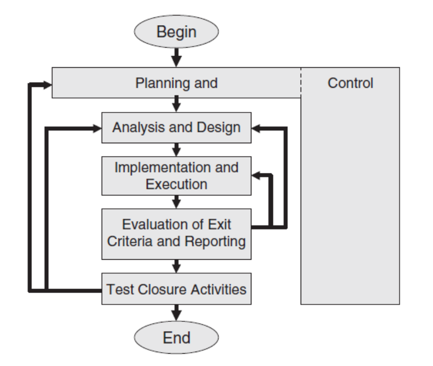

### 2023-03-02
#### 健壮性边界分析
1. 确定自变量个数
2. 多取到比最小值小，比最大值大
3. 
#### 最坏情况的边界值
1. 
2. 基于笛卡尔积
3. 基于多缺陷假设（两个或以上的变量取到最大或最小值）

- 取**中间值**时，接近中间值即可
- 取比**最小值小的值**时，可取多个，0，负数，或者小数

### 测试套件
多个测试用例集构成测试套件

### 等价类
#### 弱一般等价类
遵循单缺陷原则，要求用例覆盖每一个变量的一种取值即可，取值为有效值
#### 弱健壮等价类
在弱一般等价类的基础上，增加取值为无效值的情况
#### 强一般等价类
遵循多缺陷原则，要求用例覆盖每个变量的每种取值之间的迪卡尔乘积，即所有变量所有取值的所有组合，取值为有效值8
#### 强健壮等价类
在强一般等价类的基础上，增加取值为无效值的情况。（不仅取单个无效值，也要取多个无效值。）

### 冒烟测试

## 黑盒测试

## 白盒测试

单元测试是把黑盒与白盒测试结合

### 2023-4-27

## 复习
failure： 未满足给定的要求，它是实际结果或行为与预期结果或行为之间的差异。为了描述用户遇到问题时的事件，使用了术语"failure"
defect: 缺陷的原因是一个人的error or mistake，例如开发人员的编程有缺陷。纠正缺陷通常会引入一个或多个新的缺陷
测试的目标是：缺陷和failure

测试包括测试
- 日期
- 计划
- 测试用例
- 测试对象
- 测试条件（测试需求）
- 测试场景（几个测试用例组合在一起，一个测试用例的结果作为下一个测试案例的起点）
- 测试套件，比较测试对象的实际和预期行为（不同的测试类可以组装成一个具备测试相关功能的套件，这个套件就是test suite）

软件质量包括以下因素：功能性、可靠性（容错和可恢复性，MTBF（平均故障间隔时间））、可用性、效率、安全性、可移植性和可维护性

只要发现和纠正缺陷的成本低于失败的成本，测试就应该继续。因此，测试工作始终取决于对应用程序风险的估计
必须对单个系统部件进行风险评估，甚至对单个错误的可能性进行风险评估

测试的子任务
- 测试计划和控制
- 测试分析和设计
  - 依据：系统测试和需求规约
  - 分析测试规约，测试策略，测试用例
- 测试实施和执行
  - 逻辑测试转化为具体的测试
- 测试退出标准和报告的评估
- 测试结束活动。

测试质量包括：功能性，可靠性（容错和可恢复，failure的平均时长），适用性，效率，安全，轻便和可维护（体现在使用手册，维护手册等）

在一个项目中测试是开发的1.2倍

基于风险的测试，当发现和修正缺陷的代价小于failure，需要开展测试，具体根据经验等进行判断

影响测试工作量和成本的因素：测试人员的经验，使用工具的有效性，业务的复杂性，规约的完整性和测试方法的选择

白盒
黑盒
  - 边界值，
  - 等价类
静态
  - review
  - 工具
单元
继承

Page 23