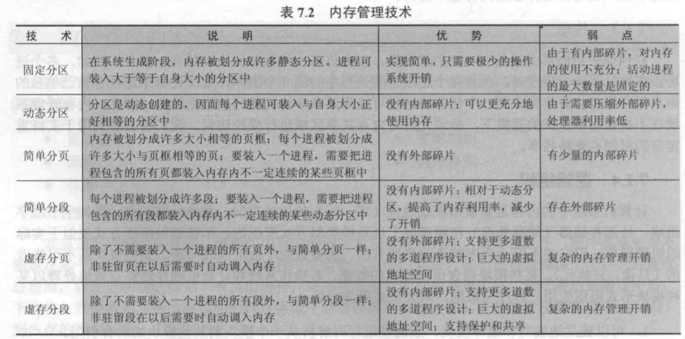
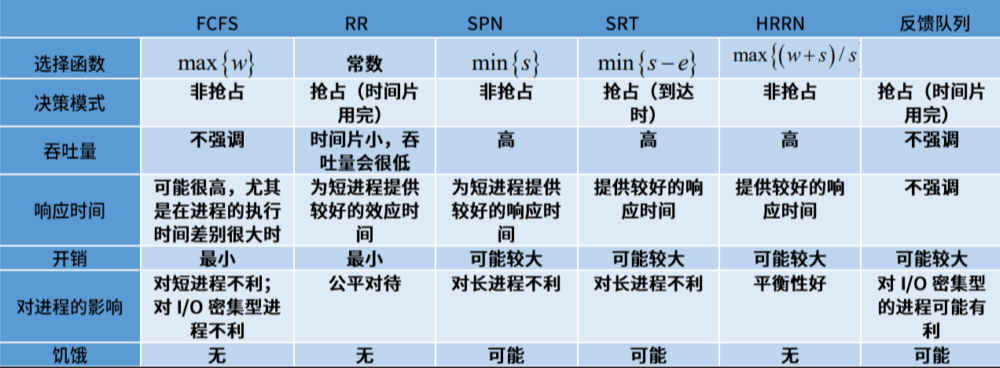


需要加强的部分：
1. 二级页表计算
 

操作系统定义：
- 一个控制程序
- 一个资源管理器

操作系统内核特征：
- 并发，计算机系统中同时存在多个运行的程序，需要OS管理和调度
- 共享，同时访问，互斥共享
- 虚拟，利用多道程序设计技术，
- 异步，服务完成的时间不确定，也可能失败（进程的异步）

演化历史：
1. 单用户系统
2. 批处理系统
3. 多道程序系统
4. 分时系统
5. 分布式系统（AloT）

操作系统的结构:
- 简单结构：MS-DOS应用和OS混在一起，使用汇编
- 单体分层结构，第0层，硬件；最高层，用户接口，每一层只使用低一层提供的服务
- 微内核结构，尽可能把内核功能移到用户空间（解决分层的效率低），灵活且安全，但性能下降

中断，异常和系统调用
- 中断：来自硬件设备的处理请求，异步，对应用程序透明
- 异常：非法指令或其他原因导致当前指令执行失败，同步，杀死或重新执行意外的应用程序指令
- 系统调用：应用程序主动向操作系统发出的请求，异步或同步，等待和持续。执行系统调用的过程：`传递系统调用参数->执行陷入指令->执行相应的服务程序->返回用户态`

进程：
- 进程与程序的关系：
  - 程序=文件
  - 任务（进程）=执行中的程序=程序+执行状态
- 所需的资源：内存（保存代码和数据）和CPU（执行指令）
- 组成：数据，PCB，程序
  - 任务控制块（TCB，也称process control block,PCB），每个任务在操作系统中有一个对于的PCB
  - PCB的组织：同一状态进程的PCB成一个链表
- 特点：动态性，独立性，制约性，并发性
- 通过对PCB的组织管理实现对进程的组织管理
- 进程**创建**（系统初始化，用户请求创建新进程，在执行的进程创建了进程），进程**等待（阻塞）**（一定是自我阻塞），进程**抢占**（高优先级进程就绪），进程**唤醒**（只能被其他进程或操作系统唤醒）
- 进程的五个状态：创建，退出，就绪（阻塞），运行，等待（一般说三个状态指后三个）。退出一定是从运行转为退出。此外还有七态模型，增加就绪挂起（进程在外存，只要进入内存即可运行），等待挂起（进程在外存并等待某事件出现），挂起是将进程放到外存

---

内存管理
- 内存管理的方式：重定位，分段，分页，虚拟存储
- 连续内存分配：给应用分配一块不小于指定大小的连续内存空间。外部碎片（**分配单元间**未被使用的内存）；内部碎片（**分配单元内**未被使用的内存）。
  - 固定分区，会产生内部碎片
  - 动态分区（最先匹配First-fit，最佳匹配Best-fit，最差匹配Worst-fit，下次匹配Next-fit）
    - First-fit：简单；外部碎片多
    - Best-fit：大部分分配的尺寸较小时，效果很好；外部碎片多，释放分区慢（链表查找），小碎片多
    - Worst-fit：小碎片少；释放分区慢，没有大的空间 
  - Buddy（伙伴系统），按照$2^{i}$分配与合并，在合并时怎么分的怎么合并
- 非连续内存分配：将一个进程放在内存中不一定连续的位置
  - 简单分段
    - 类似于动态分区，不要求所有段的长度都相等。段表放在段表寄存器中，段表中放有段表项（基址和长度）。给定一个n+m位地址，左边n位是段号，右边m位是偏移量，则段长最大$2^{m}$，在段表中查找段号对应段的物理地址起始位置，将偏移量和段表项中的段长度对比，可能无效，若有效则物理地址为起始物理地址+偏移量
  - 简单分页
    - 每一页的长度相等。页面（逻辑地址等分）到页帧（物理地址等分），实际是逻辑地址到物理地址的转化。给定一个n+m位地址，左边n位是页号，右边m位是偏移量，则一页的大小为$2^{m}$B，一个程序最多有$2^{n}$页，通过页号查找页表中对应的叶帧号**物理地址**为$2^{m}*$页帧号+偏移量
    - 存在访问性能和页表容量过大的问题。性能问题通过缓存和间接访问方式解决，快表（Translation Look-aside Buffer,TLB）缓存近期访问的页表项。在进程切换时，TLB可以清空（不同进程的逻辑地址可能相同），也可以添加地址空间标识符（Address Space Identifier,ASID）；页表容量过大通过多级页表和反置页表解决
      - 多级页表。一级页表号也叫页目录号，通过一级页表号在一级页表（页表项存二级页表位置）中找到二级页表起始位置，通过二级页表号在二级页表找到三级页表起始位置或叶帧号
      - 反置页表。整个系统一个反置页表，给定一个n+m位地址，前n位(虚拟页号)与PID进行hash在反置页表中，找到对应的页表项（页表项存有页号，PID，next(供冲突使用)）
    - 注：每个进程有一个页表，整个操作系统只有一个TLB
  - 段页式存储管理。内存共享，段S在两个进程中的段号不一定相同，在共享段表和物理内存中是同一个
- 使用虚存（虚存分页和虚存分段有不连续性，大用户空间，部分交换特点）
  - 覆盖技术：程序员手动控制在较小的可用内存中运行较大的程序。一个时间段内执行的函数不能共享一块有限空间，以函数或模块为单位
  - 交换技术：操作系统以程序为单位自动换入换出内存
  - 虚存分页：在页式存储基础上增加请求调页和页面置换（不常用的页换出，要使用的换入）。页表项结构增加了访问位（是否被访问，用于页面置换算法），修改位，驻留位（也称有效位，表示该页是否在内存中，1在内存，0在外存），保护位（允许的访问方式，只读，可读写，可执行等）等
  - 虚存分段
  - 衡量标准：有效存储访问时间（Effective memory access time,EAT）缺页率p，写回率q，则**EAT**=内存访问时间*(1-p)+缺页异常处理时间；`缺页异常处理时间=磁盘访问时间*p+磁盘访问时间*q*p`。当有TLB时，假设TLB命中率$p$，缺页率$f$，则EAT=TLB命中时间+内存命中时间+缺页异常处理时间=TLB访问时间*$(1-f)*p$+内存访问时间*$(1-p)*(1-f)$+失效时的存取时间*$f$。当快表命中时，其过程为先访问快表再访问内存

内存置换算法
- 目标：尽可能减少页面缺页次数，输入换出次数
- 局部页面置换算法（仅限于当前进程占用的物理页面内）
  - 最优页面置换算法（**OPT**），置换未来最长时间不访问的页面，实际无法实现，用于对比
  - 先进先出（**FIFO**），选择内存驻留时间最长的页面置换，维护一个有序链表
  - 最近最久未使用（**LRU**），选择最长时间未被引用的页面进行置换
  - 时钟页面置换算法（**Clock**），对页面的访问情况进行大致统计，是LRU和FIFO的折中。维护一个环型链表，每一页有一个访问位，缺页时从当前位置开始顺序检查，访问位为1则置0，为0则置换该页，指针后移
  - 改进的时钟页面置换算法。减少修改页时的处理开销。在页面中增加修改位，描述页面在过去一段时间内的写情况，缺页时修改页面访问位，跳过有修改的页面
  - 最不常用算法（**LFU**），缺页时，置换访问次数最少的页面。对于开始频繁访问，但后期不访问的页面会驻留（解决方法：计数定期减半，即右移）
- Belady现象：物理页面增加但缺页次数也增加。FIFO，Clock，LFU，改进Clock有，LRU，OPT，不清空计数的LFU无
- 全局页面置换算法（选择范围为所有可换出的物理页面），为进程分配可变数目的物理页面
  - 工作集算法。使用$W(t,\Delta)$表示在当前时刻t前的$\tau$个时间段内，所有访问页面所组成的集合，即工作集。换出不在工作集中的页面
  - 缺页率算法。缺页率=缺页次数/内存访问次数，影响因素有页面置换算法，分配给进程的物理页面数目，页面大小，程序的编写方法。调节常驻集，使缺页率保持在一个合理范围。缺页时，计算上次缺页时间$t_{last}$到现在$t_{current}$的时间间隔，若$t_{current}-t_{last}>T$（T表示容忍的缺页窗口）则置换该时间段内未被引用的页，否则增加缺失页到常驻集
  - 抖动和负载控制。
    - 抖动，进程物理页面太少，不能包含工作集（内存的进程数增加，分配给进程的物理页面数减少，导致缺页率上升）

线程
- 在一个进程中的线程可以共享进程的资源，减少进程创建的开销
- 进程是资源分配的单位，线程是CPU调度的单位
- 线程具有就绪，阻塞，执行三种状态及其转换关系
- 能够减少并发执行的时间和空间开销，可以不通过内核进行通信
- 线程独享寄存器，栈资源，共享地址空间和文件等资源
- 实现方式
  - 内核不可见的用户线程。操作系统感知不到该类线程的存在
  - 内核可见的用户线程，在内核维护现成控制块TCB，在内核实现，切换开销与进程切换开销相似
  - 内核线程。执行周期性的任务。
  - 轻量级进程，混合线程。

进程管理
- 进程切换。暂停当前运行状态，从运行状态变成其他状态

fork()的返回值
- 子进程的返回值为0
- 父进程返回子进程的标识符

exec()加载新程序取代当前进程
wait()用于父进程等待子进程结束

孤儿进程：父进程退出，其子进程还在运行。孤儿进程最终被init进程收养
僵尸进程：fork创建的子进程退出后，父进程未调用wait获取子进程状态信息，子进程的描述符还在系统中

写时复制

单处理器调度
- 比较准则：CPU使用率，吞吐量，周转时间(包括等待时间)，就绪等待时间，响应时间，公平
- 调度算法：
  - **先来先服务**(FCFS，First come, first served)。平均等待时间波动大
  - **短作业优先算法**(SJF, Short Job First或Short Process Next)。具有最短的平均周转时间。可能导致长作业无法获得CPU资源。执行时间预估$\tau_{n+1}=\alpha t_{n}+(1-\alpha)\tau_{n}$，$t_{n}$为第n次的CPU计算时间，$\tau_{n+1}$为第n+1次的CPU计算时间预估
  - **最短剩余时间算法**(SRT, Shortest Remaining Time)。支持抢占。新进程的服务时间小于当前进程的剩余时间，则执行新进程
  - **最高响应比优先算法**(HRRN, Highest Response Ratio Next)。将后备队列中响应比最高的作业投入执行。响应比R，w（就绪等待时间, waiting time），s(执行时间，service time)，则$R=\frac{w+s}{s}$。不存在饥饿
  - **时间片轮转**(RR, Round Robin)。按FCFS每个时间片轮转。有额外的上下文切换，将开销维持在1%以内
  - **多级队列调度算法**(MQ, MultiQueue)。就绪队列分成多个独立的子队列。每个队列有自己的调度策略，队列间也需要调度
  - **多级反馈队列调度算法**(MLFQ, Multi-Level Feedback Queue)。多个优先级不同的队列，优先级越高，时间片越小，作业先进入最高级队列，若一个时间片未完成优先级下降一级，否则保持。
  - **公平共享调度算法**(FSS, Fair Share Scheduling)

Stride调度
- stride越小，优先级越高，pass=big_value/优先级
- `stride_max-stride_min<=pass_max`，将stride的差用有符号数表示，可以保证stride溢出之后还可以正常运行

实时操作系统
- 正确性依赖于
- 静态优先级调度：任务执行过程中不改变任务的优先级
  - 速率单调调度算法（Rate Monotonic, RM）。通过周期安排优先级，周期越短优先级越高，执行周期最短的任务，抢占式。周期p表示任务请求时间间隔；执行时间e表示最大执行时间。N个进程下最坏情况的CPU利用率为 $N(2^{\frac{1}{N}}-1)$
- 动态优先级调度：任务执行过程中会改变任务的优先级
  - 最早截止时间优先算法（EDF, Earliest Deadline First）。截止时间越早优先级越高，执行离截止时间最近的任务。可抢占，理论最优
- 最低松弛度优先算法（LLF）。松弛度=必须完成时间-本身还需要运行的时间-当前时间

优先级反置：高优先级进程长时间等待低优先级进程所占资源的现象
优先级继承：占用资源的低优先级进程继承申请资源的高优先级进程的优先级（出现阻塞之后）
优先级天花板协议：不管是否阻塞，提高占用资源进程的优先级。占用资源进程的优先级与申请该资源的进程最高优先级相同

多处理器调度
- 单队列多处理器调度（动态进程分配）：Cache亲和性弱，缺乏可扩展性
- 多队列多处理器调度（静态进程分配）：多个调度队列，每个队列调度规则不同。负载不均衡。工作窃取，进程量少的队列不定期查看其他队列是否进程比自己多，若是则取一个或多个进程

同步与互斥
- 临界区（互斥执行的部分），访问规则：空闲则入，忙则等待，有限等待，让权等待（可选，不能进入临界区的线程释放CPU）
- 同步互斥的方法：
  - 禁用硬件中断：线程无法被停止，可能导致其他线程处于饥饿；临界区可能很长；不适合多核
  - 基于软件的解决方法：Peterson算法，Dekkers算法，N线程
  - 更高级的抽象方法：硬件提供了同步原语，原子操作指令（测试和置位Test and Set，交换指令Compare and Swap）。锁，支持多临界区，或共享主存的多处理器；可能死锁

信号量（协调共享资源访问）
- 一种抽象数据类型，由一个整型变量和两个原子操作组成  
  - P()尝试减少，sem-=1，sem<0进入等待
  - V()增加，sem+=1
- PV操作是原子操作
- PV成对使用
- 不能避免死锁问题

管程：
- 条件变量的释放处理方式（线程T1因条件A未满足处于阻塞状态，当线程T2让A满足并执行signal操作唤醒T1后，不允许T1和T2同时处于管程中，决策谁执行谁等待的策略）
  - Hoare：T2通知T1后，T2阻塞，T1马上执行；T1执行完成后唤醒T2执行。切换开销大
  - Hansen：T2通知T1后，T2继续执行，T2执行完成后T1开始执行
  - MESA：T2通知T1后，T2继续执行，T1进入入口等待队列重新竞争访问

生产者-消费者；读者-写者；哲学家进餐；理发师理发
哲学家进餐：
- and型信号量是指同时需要多个资源且每种占用一个资源时的信号量操作
- 五种方案

读者-写者：
- 读者优先策略；写者优先策略

死锁问题的必要条件：
- 互斥：任何时刻只有一个进/线程使用资源实例
- 持有并等待：
- 非抢占
- 循环等待

死锁解决：
- 死锁预防：破坏必要条件（对于循环等待破坏是按照资源排序的顺序请求资源）
- 死锁避免：确保系统不会进入死锁状态（安全状态下一定没有死锁）