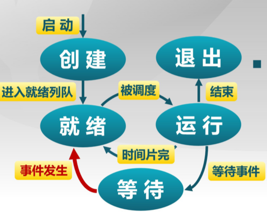


 

操作系统定义：
- 一个控制程序
- 一个资源管理器

操作系统内核特征：
- 并发，计算机系统中同时存在多个运行的程序，需要OS管理和调度
- 共享，同时访问，互斥共享
- 虚拟，利用多道程序设计技术，
- 异步，服务完成的时间不确定，也可能失败（进程的异步）

演化历史：
1. 单用户系统
2. 批处理系统
3. 多道程序系统
4. 分时系统
5. 分布式系统（AloT）

操作系统的结构:
- 简单结构：MS-DOS应用和OS混在一起，使用汇编
- 单体分层结构，第0层，硬件；最高层，用户接口，每一层只使用低一层提供的服务
- 微内核结构，尽可能把内核功能移到用户空间（解决分层的效率低），灵活且安全，但性能下降

中断，异常和系统调用
- 中断：来自硬件设备的处理请求，异步，对应用程序透明
- 异常：非法指令或其他原因导致当前指令执行失败，同步，杀死或重新执行意外的应用程序指令
- 系统调用：应用程序主动向操作系统发出的请求，异步或同步，等待和持续。执行系统调用的过程：`传递系统调用参数->执行陷入指令->执行相应的服务程序->返回用户态`

进程：
- 进程与程序的关系：
  - 程序=文件
  - 任务（进程）=执行中的程序=程序+执行状态
- 所需的资源：内存（保存代码和数据）和CPU（执行指令）
- 组成：数据，PCB，程序
  - 任务控制块（TCB，也称process control block,PCB），每个任务在操作系统中有一个对于的PCB
  - PCB的组织：同一状态进程的PCB成一个链表
- 特点：动态性，独立性，制约性，并发性
- 通过对PCB的组织管理实现对进程的组织管理
- 进程**创建**（系统初始化，用户请求创建新进程，在执行的进程创建了进程），进程**等待（阻塞）**（一定是自我阻塞），进程**抢占**（高优先级进程就绪），进程**唤醒**（只能被其他进程或操作系统唤醒）
- 进程的五个状态：创建，退出，就绪（阻塞），运行，等待（一般说三个状态指后三个）。退出一定是从运行转为退出。此外还有七态模型，增加就绪挂起（进程在外存，只要进入内存即可运行），等待挂起（进程在外存并等待某事件出现），挂起是将进程放到外存
