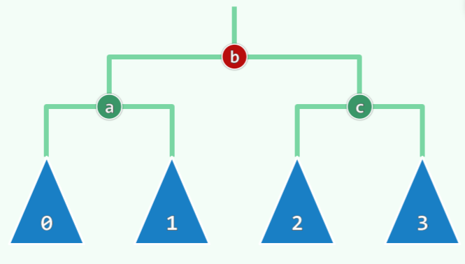
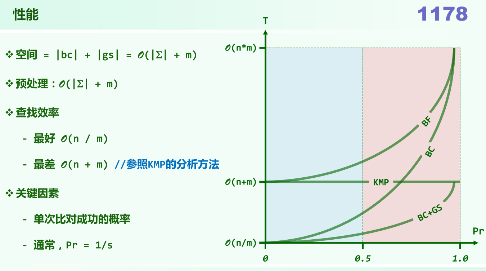
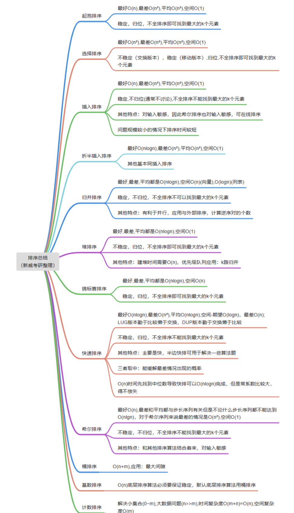

三种符号，描述足够大的问题，可以理解为以下内容
- $\Omicron$：`T(n)<`，其中 $T(n)=\Omicron(f(n))$
- $\Theta$：`T(n)=`，其中 $T(n)=\Theta(f(n))$
- $\Omega$：`T(n)>`，其中 $T(n)=\Omega(f(n))$

$\log^{*}{n}$，表示取多少次对数，值小于等于1，例如对于 $\log^{*}{16}$ 进行三次 $log_{2}$运算后值为1，则 $\log^{*}{16}$ = 3

$\log{n}=\Omicron(\log\log{n})$ 错误
$\log^{*}{n}=\Omicron(\log^{*}(\log{n}))$ 正确，因为 $\log^{*}{n}=\log^{*}(\log{n})+1$

级数求和：
- $\sum_{i=1} i^{p}=\Omicron(n^{p+1}), p为常数$，比幂次高一阶
- $\sum_{i=1}^{n} a^{i}=\Omicron(a^{n})$，与末项同阶
- 调和级数 $\sum_{k=1}^{n} \frac{1}{k}=\Theta(\log n)$
- 对数级数 $\sum_{k=1}^{n} \ln k=\Theta(n \log n)$

减治：将一个大规模问题分为两个子问题，其一平凡（已解决），另一规模缩减
分治：将一个大规模问题分为两个规模几乎相当的子问题

主定理：
分治策略的递推公式形如：$T(n) = aT(\frac{n}{b})+\Omicron(f(n))$ ，表示原问题被分为a个规模大小为n/b的子任务，任务的耗时f(n)

最长公共子序列LCS(Longest Common Subsequence)

平均复杂度
分摊复杂度
- 向量扩容问题
  - 容量递增（满后追加固定容量），增量为I，插入$n=m*I$个元素，则第0, I+1, 2I+1, 3I+1...次需要扩容，复制成本总耗时为$I+2I+...=I\frac{(m-1)*m}{2}=\Omicron(n^2)$，均摊成本$\Omicron(n)$
  - 容量加倍（满后加倍），均摊成本$\Omicron(1)$
当平均复杂度和分摊复杂度相同时，两个互不蕴含

递归算法
- 时间复杂度：递归实例的个数
- 空间复杂度：递归深度
- eg. 斐波那契空间复杂度$\Omicron(n)$，时间复杂度$\Omicron(2^{n})$

查找：
- 查找长度：针对查找成功和查找失败，考察关键码的**比较次数**(比较过程先左后右，查找在0,7中查找4，则比较两次，先`a[4]<4`然后`a[4]>4`，则查找成功)
- 平均查找长度：所有元素的总查找长度/元素个数，二分法的平均查找长度为$\Omicron(1.5logn)$, Fibonacci查找的平均查找长度为$\Omicron(\log _\phi 2 *\log _2 n)=\Omicron(1.44 log _2 n)$
- fibonacci查找，若有n=fib(k)-1，二分的分点是mi=fib(k-1)-1。对于长度为n=fib(k)-1的向量，查找成功的长度递推式为$C_k=C_{k-1}+fib(k-1)-1+2+C_{k-2}+2(fib(k-2)-1)$，长度为$Fib(k) – 1$的向量比较次数最多为$k-1$次
- 二分查找，对于长度为$n=2^k-1$的向量，查找成功的查找长度递推式为$C_k=C_{k-1}+2^{k-1}-1+2+C_{k-1}+2(2^{k-1}-1)$，即$C_k=(\frac{3k}{2}-1)(2^k-1)+\frac{3k}{2}$

插值查找：利用向量元素分布规律，根据目标数值，通过插值估计出其大致所对应的秩，缩小搜索范围，称作插值查找；期望运行时间为 $\Omicron(loglogn)$

**逆序对**：不是升序排列的数对（序列中`i<j,且A[i]>A[j]`则为一个逆序对）
- 通过归并的思想可以在$\Omicron(nlogn)$内计算完逆序对个数，

起泡排序：
- 时间效率，最好 $\Omicron(n)$，最坏 $\Omicron(n^{2})$
- 是稳定的（重复元素在输入输出中的相对次序保持不变）
- 交换的次数等于序列所含逆序对的总数

归并排序：
- 分治思想，每个一分为二
- 时间效率，最坏 $\Omicron(nlogn)$
- 是稳定的（出现相同元素，左侧子向量优先）
- 为了避免反复new/delete可以在算法开始时申请一个足够大的缓冲区，作为全局变量使用

位图：
该数据结构提供`set()`,`clear()`,`test()`三种接口，每个接口的时间复杂度均为 $\Omicron(1)$

列表
- 列表等价于双向链表
- 期望复杂度 $(1+2+...+n)/n=\Omicron(n)$
- 插入元素和删除元素的指针顺序
- **循环节**，长度不超过n，循环节之间互不相交

选择排序
- 在无序区中选择一个最大的放到有序区的最小部分
- 找出最大值后基于交换的选择排序会导致不稳定，采用平移法（选择排序一般是用交换）是稳定的（列表的移动复杂度为常数）
- 总体复杂度为 $\Omicron(n^{2})$（最好也是$\Omicron(n^{2})$）
- 基于选择排序可以衍生出堆排序（保存了比较中的结果）

插入排序
减而治之
- **在线算法**：通过网络传输可以边传输边操作，不必等所有数据都传输完（优点）
- 在无序区中取最左边的元素，在有序区中找到合适的位置插入
- 逆序对的间距对算法有影响（输入敏感性）
  - I个逆序对，关键码的比较次数不超过$\Omicron(I)$
  - 有I个逆序对，总运行时间$\Omicron(n+I)$

列表的游标实现：用个数组，一个放数据，另一个放link

---

栈
- 后进先出
- 应用：
  - 进制转换：转换后低位在栈低，高位在栈顶，不断出栈即可实现
  - 括号匹配：遇到左括号进栈，右括号成对消除（分别检查各种括号是否匹配，若分别匹配，则整体匹配的策略错误，反例`({)}`）
  - **栈混洗**(SP,stack permutation)：可能的结果个数
    $$
    SP(n)=\Sigma_{k=1}^{n}SP(k-1)SP(n-k) \\
     =catalan(n) \\
     =\frac{(2n)!}{(n+1)!(n)!}
    $$
    - 以下情况也是Catalan数：
      - n对括号组成的合法表达式种类，Catalan(n)
      - n节点的二叉树形态，Catalan(n)
      - n节点互异的BST种数，Catalan(n)
      - n叶节点的真二叉树种类，Catalan(n-1)
    - 检测禁形（不可能出现的排列）：对于任意`1<=i<j<k<=n`,`[..., k,...,  i, ..., j, ...>`不可能出现(`>`表示栈顶)
- 中缀表达式求值，需要两个栈，一个操作数栈，一个操作符栈
- 部分非法表达式也可以得到结果
- 逆波兰表达式(Reverse Polish Notation, RPN，后缀表达式)：不使用括号，操作数的次序不变。在求值中只需要一个栈放操作数，从前开始扫描，扫描到操作数入栈，到操作符，操作数栈出栈计算再进栈

队列
- 与栈类似，但先进先出

Steap=Stack+Heap（栈+向量堆）
- 具有`pop`,`push`,`getMax`三种操作，用于求栈中的最大值
- 本质是一个放实际数据的栈和一个维护最大值的栈
- Steap结构的进栈数据栈照常进栈，最大值栈需要`push(max(P.top(),current))`即最大值栈顶和当前数据哪个大哪个进栈；出栈时两个栈都出栈即可；获取最大值时，直接返回最大值栈的栈顶即可。上述操作的复杂度均为$\Omicron(1)$

Queap=Queue+Heap
- 有进队，出队，获取最大值三种操作
- 也是两个队列
- 出队两个队列均出队即可；入队时都入队，但最大值队需要根据入队的数据对原来的数据修改，最坏情况下复杂度可达$\Omicron(n)$；获取最大值时返回最大值队的队尾

双栈当队
直方图最大矩阵算法

---

树
深度：不包括根节点，**根节点深度为0**
高度：叶子深度最大者为高度，空树高度为-1.
一个节点的深度+节点的高度<=树的高度，当该节点为最深的叶子节点时取等

二叉树（节点有序）
- 满树：深度为k的节点所在层，最多有$2^{k}$个节点
- 设度数（出度）为0,1,2的节点各有$n_{0},n_{1},n_{2}$个
  - 边数 $e=n-1=n_{1}+2n_{2}$
  - 当$n_{1}=0$时，为**真二叉树**
  - 叶节点数$n_{0}=n_{2}+1$ 
- 树，二叉树，森林之间可以相互转化
- 遍历算法
  - 前序遍历：VLR，复杂度为$\Omicron(n)$
  - 中序遍历：LVR，类似于节点在x轴上的投影，单次顺着入栈可能有$\Omega(n)$次，需要$\Omega(n)$时间
  - 后序遍历：LRV
  - 层次遍历：使用队列，复杂度$\Omicron(n)$
- 表达式树：叶节点是操作数，非叶节点为操作符
  - 一个表达式可以确定出一个二叉树（给一个序列不能确定出唯一的二叉树）

完全二叉树
- 叶节点都在最低两层里，完全二叉树不一定是真二叉树
- 左满二叉树，右完全；左完全，右满

重构
- **先序或后序+中序**可以确定一个二叉树
- 已知先序和后序不一定能确定一个二叉树（先序根节点的后一个节点一定是左子树，后序根节点的前一个节点一定是右子树，两个节点不同时可以唯一确定），即先序+后序+真二叉树可以唯一确定
- 先序+后序可以确定出层次遍历序列
- 后+层可推先序
- 先+层得不到后

增强序列
- 将NULL的节点补充用"^"替代，构成一个真二叉树，然后输出对应的序列
- 在增强的先序、后序遍历中通过分而治之可以重构出二叉树（中序增强序列无法重构树）

PFC与Huffman编码（**二叉树中左0右1**）
- PFC（前缀无歧义，prefix free code）：不考虑字符权重，字符不必等长，解决歧义。通过平均编码长度考察。字符放在二叉树的叶子节点上
- 最优编码树，真完全二叉树是最优编码树
- Huffman树：考虑字符频率（权重），通过平均带权深度考察，构建算法（维护一个优先级队列）
  - 每个内部节点都有两个孩子。（即真二叉树）
  - 对任一内部节点左右子树互换平均带权深度不变（因此不唯一，且高度也不一定一样）

树的直径：任意两个结点路径长度中的最大值。这条路径可能穿过也可能不穿过根结点。

---

图
简单图：不含自环（同一顶点自我邻接）
欧拉环路：各边出现一次
哈密顿环路：各顶点出现一次
支撑树（生成树，spanning tree）：一个图的支撑树不唯一，总权值最小的是最小支撑树（minimum spanning tree），e=n-1
平面图：在平面中边与边不产生交叉，必要条件：e<=3n-6
欧拉法则：R+V-E=2（R区域个数，V顶点个数，E边的个数）
连通图：任意两个顶点之间都能够连通
有向无环图：DAG（Directed Acyclic Graph）
割：将原图分为两个点集
关节点：将关节点删除之后，原图的连通分量增加
双连通图：没有关节点的图

图的存储：
- 邻接矩阵：顶点的邻接关系，横轴与纵轴表示顶点，交汇处表示有无边，空间$n^{2}$
- 关联矩阵：顶点与边的关联管理，纵轴表示顶点，横轴表示边，交汇处表示点是否与边关联，空间$n*e=n^{3}$，一行代表了与该顶点连接的边有哪些
  - 邻接矩阵与关联矩阵的关系：A邻接矩阵，M关联矩阵，D对角矩阵，表示第i个顶点的度，则$A+D=MM^{T}$
- 邻接多重表：二重列表，每条边只存储一次，一条边一个节点（含有三个指针），空间消耗$\Omicron(n+e)$

BFS（Breadth-First Search）
- 逐圈向外访问，构造出一棵树，使用队列
- 应用：找出连通图，最短路径
- BFS过程中，
  - 队列中的顶点按到s的距离单调排列
  - 首末顶点距s的距离不超过1
  - 从s到v点的路径，是二者在原图中的最短路径

DFS（Depth-First Search）
- 顺着一个方向找到低，然后再换个路找到低
- 经DFS后确定的树边，不会构成回路
- 边的分类
  - tree(v,u)，可以从v进入处于undiscovered状态的u
  - backward(v,u)，从v进入处于discovered状态的u（出现backward必有环，后向边<=回路数）
  - forward(v,u)，从当前v进入处于visited状态的u，且v更早被发现
  - cross(v,u)，从当前v进入处于visited状态的u，且u更早被发现

顶点状态：
- UNDISCOVERED：所有点的初始状态
- DISCOVERED：刚开始被发现（bfs中表现为刚入队）
- VISITED：被访问过并且其所有邻接点也被访问过（bfs中表现为出队）

边的状态：
- UNDETERMINED：未确定的，所有边的初始状态
- TREE：从当前节点v指向undiscovered状态的u节点
- CROSS：dfs与bfs定义不同。bfs指从当前节点v指向非undiscovered状态的u节点；dfs中从当前v进入处于visited状态的u，且u更早被发现
- FORWARD：dfs独有。dfs中从当前v进入处于visited状态的u，且v更早被发现
- BACKWARD：dfs独有。dfs中从当前节点v指向discovered状态的u 

拓扑排序：
- 任给一个有向图，将所有顶点排成一个线性序列
- 可拓扑排序的有向图，必定无环
- 顺序输出零入度顶点
- 逆序输出零出度顶点

优先级搜索：
- 优先级数越大/小，优先级越低/高
- Catley公式：完全图 $K_{n}$ 有 ${n^{n-1}}$ 棵支撑树

Prim算法：最小生成树
Kruskal算法：最小生成树。适用于稀疏图。将所有边按权重排序，迭代每次找最短的边，该边的顶点来自不同的树，将该边连接的两棵树合二为一，共迭代n-1次选出n-1条边。

Dijkstra算法：两点之间的最短路径（各边权重需要为正）。计算S到其余顶点的最短距离
- 某一点到其余点的最短路径的并，形成SPT（shortest path tree）连通且无环，但SPT不一定等于MST

Floyd算法：计算所有点之间的最短距离
- 可以通过调用n次Dijkstra算法$\Omicron(n^{3})$实现folyd一致的结果
- 效率为$\Omicron(n^{3})$，可以出现负权边
- $d^{k}(u,v)$表示u中途经过前k个节点到v的最短距离，则$d^{k}(u,v)\\=w(u,v),if k=0\\=min(d^{k-1}(u,v),d^{k-1}(u,k)+d^{k-1}(k,v),if k≠0)$

关节点
- DFS树中叶节点一定不是关节点
- hca(v)以v为根的子树经后向边能抵达的最高祖先 
- 找关节点划分双连通分量（极大双连通子图）算法，与DFS类似，此处值得**反复揣摩**

并查集：
- 控制树高：路径压缩

搜索二叉树（BST）：
- 节点不小于左子树，不大于右子树
- 中序遍历，单调非降
- 查找方式与二分查找类似，与树高有关
- 插入的节点必然是叶节点
- 删除：
  - 左右子树其一为空，用子节点取代当前节点即可
  - 左右子树均非空，找中序直接后继（要么单分支，要么叶节点），交换位置后转化为第一种情况再删除
- 适度平衡的BST称为**平衡二叉搜索树**（BBST包含AVL），高度渐进地不超过$\Omicron(logn)$
- 经过不超过$\Omicron(n)$次旋转，等价的BST均可相互转化

平衡二叉树（AVL Adelson-Velsky & E. Landis）：
- 平衡因子：左右子树高度差
- zig顺时针旋转，zag逆时针旋转
- 任意一个节点的平衡因子绝对值小于等于1
- AVL树未必理想平衡，但必然适度平衡
- 高为h的AVL树，至少包含$S(h)=fib(h+3)+1$个节点
- 删除可能造成失衡，但至多一个节点失衡，通过旋转复衡后更高祖先可能失衡，需要向上检查，最坏下达$\Omicron(logn)$
- 插入可能从祖父开始，每个祖先同时失衡，$\Omicron(1)$
- 复衡总结：设g为**最低**失衡节点，沿**最长**分支考察三代g,p,v，按照中序遍历次序命名为`a<b<c`，他们的四棵子树按中序命名为$T_{0},T_{1},T_{2},T_{3}$则原本以g为根的子树调整为如下所示
- 查找，删除，插入最坏情况复杂度为$\Omicron(logn)$，$\Omicron(n)$空间
- 对于一棵树删除一个节点，再将该节点插入，树的拓扑结构可能变化

伸展树
- 原因：被访问后的节点很可能很快再次被访问（局部性）
- 节点v一旦被访问（查找）随即推送到根
- 推送策略：
  - 单层伸展，自下而上逐层旋转，旋转次数呈周期性算术级数，分摊$\Omega(n)$
  - 双层伸展，zig-zig或zag-zag，分摊$\Omicron(longn)$，若是v只有父亲没有祖父，则只做zig或者zag
- 插入/删除，插入和删除过程自带有一次伸展，因此可以直接在根节点插入删除
- 无需记录平衡因子
- 分摊复杂度$\Omicron(logn)$（即使不具有局部性）
- 局部性强、缓存命中率极高时（即 k << n << m） 
  - 效率为自适应的$\Omicron(log k)$
  - 任何连续的m次查找，都可在$\Omicron(mlogk+nlogn)$时间内完成
- 不能杜绝单次最坏情况出现

B树
- m阶B树，每个超级节点含有[$\lceil m/2 \rceil,m$]个分支，节点含有`分支数减一`个关键码
- B树高度（**包括外部节点**）决定IO次数（一般默认根节点在内存中），$log_{m}(N+1)≤h≤1+log_{\lceil m/2 \rceil}\lfloor (N+1)/2 \rfloor$，m阶B树，总共有N个关键码
- 查找，在每一个节点内顺序查找
- 插入，插入后当节点关键码达到限制，取下标为$\lfloor m/2 \rfloor$(下标从0开始)关键码上升一层，并分裂（插入也可以通过旋转解决，但优先分裂的策略不会导致空间利用率的显著下降，利用率最低不小于50%）
- 删除，对于叶节点，兄弟节点关键码个数足够，可以从兄弟节点借用（旋转），否则将父节点关键点拉下来（合并，可能会向上传播，至多$\Omicron(h)$层）；对于非叶节点，找后继然后交换删除
- 任意非叶节点后继均在叶节点中

B*树
- 将内部节点分支数下限提高为$\lceil \frac{2m}{3} \rceil$，空间利用率最低为$\frac{k}{k+1}$

红黑树
- 增设外部节点NULL，成为真二叉树
- 树根必为黑色，节点为红则子必黑，外部节点全为黑，外部节点到根途径黑节点数目相等
- n个内部节点的红黑树，高度h满足$log_{2}(n+1)≤h≤2log_{2}(n+1)$
- 插入：（插入节点为根节点除外）按照BST规则插入节点x（必为叶节点），x染红，若x的父节点p为黑则成功，p为红需要分两种情况。考察祖父节点g，叔父节点u(g的另一分支的根)
  - u为黑，做局部3+4重构，b转黑，a或c染红（最终ac全红）。**旋转1次，染色2次，结束**
  - u为红，p和u转黑，g转红，可能会向上传递造成双红，则等效为插入g，直到树根或满足条件。**旋转0次，染色3次，可能双红上传**
- 删除：（最多）按照BST的删除，转为单分支情况，
  - 被删节点x和子树根节点r**其一为红**。若x为红，则正常删除；若r为红，与x交换颜色，结束
  - x和r**均为黑**，考察x的父节点p，p的另一个子节点s，分四种情况
    - BB-1：s为黑，且至少有一个红孩子t，对t,s,p做3+4重构，r保持黑，a,c染黑，b继承p的颜色。**黑s有红子t，旋转1-2次，染色3次，结束**
    - BB-2R（两个黑孩子，p为红）：s为黑，且两个孩子均为黑，p为红。p和s换色。**黑s无红子t，染色2次，结束**
    - BB-2B（两个黑孩子，p为黑）：s为黑，且两个孩子均为黑，p为黑。s染红，r与p保持黑。可能向上传递，相当于删除p的情况，至多$\Omicron(logn)$层。**黑s无红子，染色1次，上传**
    - BB-3：s为红（p和s的孩子必然黑）。对p单旋，s转黑，p转红，然后按照BB-1或者BB-2R调整即可。**红s，转为BB-1或BB-2R**

---

散列
- 装填因子：$\lambda=\frac{N}{M}$
- 设计原则+评价标准：确定，快速，满射，均匀

开放散列（开散列）
- 多槽位：预留若干槽位，可能造成空间浪费，并且槽位有限
- 独立链：每个桶有一个列表，任意多次的冲突都可解决，但指针本身占空间，节点动态分配和回收耗时，空间缓存未必连续，系统缓存很难生效
- 公共溢出区：单独开辟一块连续空间，将冲突词条存入此区域。最坏情况下，处理冲突词条所需的时间正比于溢出区的规模

封闭散列（闭散列）
- 开放定址：沿试探链逐一查询下一个桶单元，直到命中成功
- 线性试探：一旦冲突试探下一个紧邻的桶。无需附加指针，链表等。数据聚集现象严重。在删除时使用**懒惰删除**，即对被删除做标记，在查找时如果该处有标记则继续查找，否则结束。
- 平方试探：出现冲突试探下一个平方数(+1,+4,+9,+16)。可以缓解聚集现象，对于大散列IO操作增加。装填因子≤0.5，且M为素数，则一定能够找出
- 双向平方试探：表长取M=4k+3类的素数，必可以保证查找链前M项互异
- 再散列：出现冲突以hash(key)为偏移量重新确定地址
- 重散列：集体搬迁到一个更大的散列，将原来散列的数据重新**插入**新的散列中

散列桶的应用[最大间距](https://blog.csdn.net/whutshiliu/article/details/106674509)
桶排序
- 借助桶实现排序（将10进制数字分别以个位，十位等进行排序）
- 底层排序需要保证稳定（若不稳定将导致排序结果错误）
- 时间复杂度为$\Omicron(n)$
- 常对数密度的整数集，取n个来自$[0,n^{d})$的整数
  - 对数密度=$\frac{lnn}{lnn^{d}}=\frac{1}{d}=\Omicron(1)$

计数排序
- 记录大于元素和等于且在前出现的元素个数，可以得出元素的秩
- 执行时间不超过$\Omicron(n+M)$，来自`[0,M)`范围内的n个整数，适合小集合，大数据情况

跳转表
- 分了多层，存放重复的数据（一种存储结构）。跳转表高度（与单个塔高有区别）h=$\Omicron(logn)$的概率很大
- 查找，受纵向和横向的影响。纵向跳转次数，累计不过expected-$\Omicron(logn)$，在同一层连续跳转的时间成本不超过2

优先级队列
- 借助完全二叉堆实现，秩从0开始
- 插入。与插入节点的父节点比较，若更大则交换，并向上传播。在$\Omicron(logn)$内完成。数学期望为$\Omicron(1)$
- 删除。顶与末尾交换删除，然后根部取左右最大子节点与之比较，若根小则交换，再向下传播，直到满足所有子树的根为最大值。在$\Omicron(logn)$内，数学期望为$logn$
- 建堆。Floyd建堆。子堆的逐层合并。$\Omicron(n)$
- 为了同时进行最大最小值的维护，可以使用最小最大堆结构
  - [最小最大堆](https://www.baeldung.com/java-min-max-heap)，根节点所在层为0，奇数层每个节点大于后代；偶数层每个节点小于后代，根节点为最小值，第二层两个节点之一为最大值，插入与删除在$\Omicron(logn)$内

堆排序：
- 借助大顶堆，反复摘出最大值，直至堆空
- 复杂度$\Omicron(nlogn)$，空间复杂度$\Omicron(1)$，不稳定的

k路归并
- k组有序向量，将各向量的队首元素，借助小顶堆，找出最小，然后小顶堆删除最小，插入对应向量的下一个元素，直到所有向量为空

锦标赛排序
- 约定小者胜，叶节点为待排序元素（不足$2^{i}$则需要用正无穷补全），内部节点是两个孩子的胜者。删除根节点元素（包括叶节点，需改为正无穷，重新排除胜者）
- 空间复杂度$\Omicron(n)$，时间复杂度$\Omicron(nlogn)$，是稳定的
- 败者树
  - 内部节点存放败者，同时增加根节点的"父节点"表示冠军(该父节点不是根)，每次都是胜者与胜者比较，败者上升。
  - 根节点不一定是亚军

多叉堆
- 一个节点可以有d个子节点，任意节点i的子节点下标为`d*i+1`,`d*i+2`...`d*i+d`
- 堆高度为$\Omicron(log_{d}n)$
- 上升成本$log_{d}n$，下降成本$d*log_{d}n=\frac{d*ln2}{lnd}*log_{2}n$，当$d*log_{d}n>2*log_{2}n$时下降成本增大
- 对于PFS来说，运行时间约为$(n*d+e)log_{d}n$取d约等于$\frac{e}{n}+2$总体性能最优。稀疏图效率$e*log_{d}n=\Omicron(n*logn)$；稠密图效率$\Omicron(e)$，对稠密图优化较大

Fib堆
- PFS基于fib堆的运行时间为$\Omicron(e+nlogn)$

左式堆（Crane堆）
- 保持堆序性，增加新条件（左倾性，内部节点x的npl(lx)>=npl(rx)），方便堆合并。更多节点分布在左侧分支
- 左式堆的子堆必为左式堆
- NPL(Null Path Length)，引入外部节点NULL，构成真二叉树，x到外部节点的最近距离,npl(NULL)=0,npl(x)=1+min{npl(rx),npl(lx)}
- 右侧链，rChain(x)从x出发一直沿右分支前进。右侧链长度为d的左式堆，至少含有$2^{d}-1$个内部节点，$2^{d+1}-1$个节点（无上限）；n节点的左式堆中右侧链长度$d<=\lfloor log_{2}(n+1) \rfloor -1=\Omicron(logn)$
- 合并。合并之后的右侧链不一定是合并前的右侧链
- 插入，删除，构建

---

串
模式匹配
- 在字符串T（长度n）中找到子串P（长度m）
- 蛮力策略**bf**(brute force)：最好情况为$\Omega(n)$（子串P在T的尾部），最坏$\Omicron(m*n)$（移动n-m次，每次移动后比较m次）
- **KMP算法**：指向T串当前位置的指针i永远不需要回退，与指向P串的指针j
  - 若比对成功，i,j同前进一次；比对失败，j回退t步，需要确定t
  - 计算t：准备一个**next表**，`next[j]`表示`P[0,j)`串的最长**公共**的**真前后缀**(不包含本身的相同的最大前后缀)的长度，`next[0]=-1`，在实际计算next表中`next[j+1]=next[j]+1 , iff P[j]=P[next[j]]`
  - 构造next表的复杂度$\Omicron(m)$
  - 总体运行时间$\Omicron(m+n)$
  - 改进版KMP：常数级别的改进，对next表做改进。**改进版next表**构造方法：在程序运行中可直接计算出改进版next表，为了方便理解，可以先计算出原next表再构造，若`P[j]=P[next[j]]`，递归找到最根本的相等处将其原next值作为改进版`next[j]`的值；若`P[j]!=P[next[j]]`，直接挪用原`next[j] `表的值
- **BM算法**：预处理模式串P，构造gs表和bc表
  - 构建bc表，利用失配比对信息，画家算法，需要预知字符集（以便为bs确定空间）保存字符在P中最靠右的位置，$\Omicron(s+m)$。只使用bc表时，若坏字符（T中与P不匹配的字符）在bc表中的下标大于`j`（坏字符在P当前指针的右侧）则P右移一次；若坏字符在bc表的下标小于`j`则左移到与左侧最近的位置
  - 构建gs表，利用匹配比对信息。与KMP中的next构建类似。ss表，`ss[j]`表示`P[0,j]`的所有后缀与`P`某一个后缀匹配的最长长度，构造ss表$\Omicron(m)$。`ss[j]==j+1`时，`gs[i]=m-j-1`，其中`(i<m-j-1)`，表示某个完整前缀和后缀完全匹配，后缀之前的字符只要失配，P即可后移这么多单位；`ss[j]<=j`时，`gs[m-ss[j]-1]=m-j-1`，表示模式串中间的某一段和后缀匹配
  - 最好情况下$\Omicron(\frac{n}{m})$，最差情况下$\Omicron(m*n)$
- 算法效率对比，横轴表示单词比对成功的概率，即该字符出现的概率。从图中说明字符集越小，KMP比BF效率更高
- **FR算法**(Karp-Rabin)。将字符串映射为数字。对于字符集为d的串，用d+1个数与之映射，字符从1开始。对于字符集大且模式串P长的字符串，可以通过散列压缩降低时耗。
  - 使用快速指纹更新，利用hash之后的相邻串，前一子串删除首字符后的后缀，与后一子串删除末字符之后的前缀完全相同

---

排序
快速排序
- 定轴点。轴点左侧数字小于轴点，右侧大于轴点
  - LUG版（less-undetermined-greater）。取一个候选者，`[0]`向内交替的移动low和high指针，直到low与high一致，将轴点`[0]`放入L,G之间即可。各元素最多移动1次(候选者2次)，累计$\Omicron(n)$时间，$\Omicron(1)$空间。对于整个算法，**最好情况**下左右划分接近$T(n)=2T(\frac{n-1}{2})+\Omicron(n)=\Omicron(nlogn)$；**最坏情况**划分$T(n)=T(n-1)+T(0)+\Omicron(n)=\Omicron(n^{2})$
  - DUP版(duplicate)。与LUG原理相似，但指针一旦与轴点相等就交换到另一个指针处理
  - LGU版(less-greater-undetermined)。两个指针，一个指向G的最低位，一个指向U，U比轴点小，交换G和U，比轴点大，U前进
- 递归深度$\  Omicron(logn)$，最差$\Omicron(n)$

选取众数：摩尔投票法[参考网站](https://zhuanlan.zhihu.com/p/387744743)，$\Omicron(n)$时间，$\Omicron(1)$空间
选取中位数：两个有序向量中找中位数（两边逐次减半）

shell排序
- 插入排序的一种
- 选定步长，同一列进行排序
- 输入敏感（输入的序列不同，效率不同）
- 最好$\Omicron(n)$，既已有序；shell序列最坏$\Omega(n^{2})$
- shell序列，步长为1,2,4,8,..；PS序列为shell序列减一，时间复杂度 $\Omicron(n^{\frac{3}{2}})$，Pratt序列$h_{i}=2^{p}*3^{q}$

排序总结

- 归位：在算法执行过程中，每一次至少有一个元素在自己最终应该在的位置上