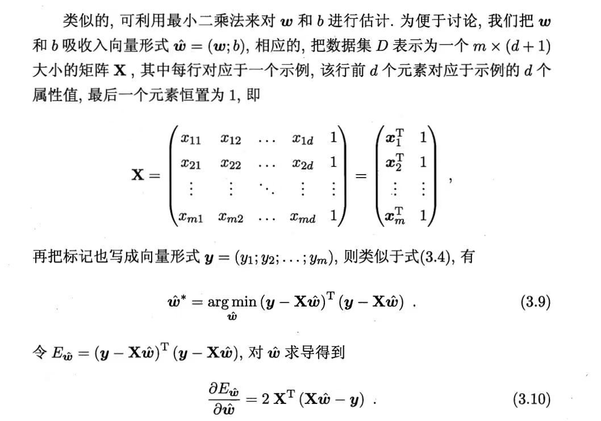
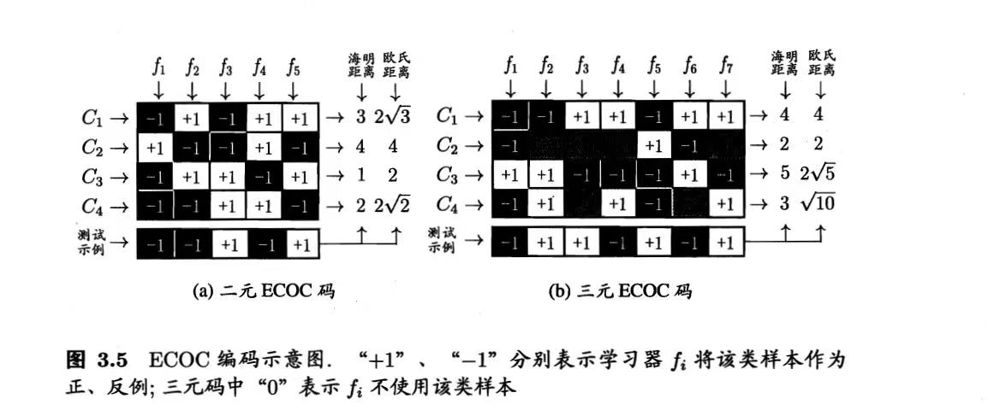
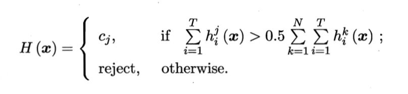


仅作为作者阅读《机器学习》所做笔记，部分内容略去，个人认为本书通识价值与理论价值较高，但仅依赖于本书可能还是缺少实践。
 
## 基础知识
### 范数
$L_0$范数表示向量中非0的个数，$\boldsymbol{||x||}=非零元素个数$

$L_1$范数表示向量各元素绝对值之和，$\boldsymbol{||x||}=\Sigma^m_{i=1}|x_i|$

$L_2$范数表示向量的模，$\boldsymbol{||x||}=\sqrt{\Sigma^m_{i=1}x^2_i}$

$L_\infty$范数表示元素绝对值的最大者，$\boldsymbol{||x||}=max{|x_1,x_2,...,x_m|}$

## 书本正文
### 基础概念
`generalization error`(泛化误差)：在新样本上的误差
`training error/empirical error`（训练/经验误差）：训练集上的误差

### 评估方法
数据集划分方式：
1. 留出法(`hold out`)：数据集划分为两个互斥集合，一个训练集，一个测试集
2. k倍交叉验证法(`cross validation`)：数据集划分为k个互斥子集，把k-1个集合的并作为训练集，余下的作测试集，进行k次训练和测试
3. 自助法(`bootstrap`)：有放回取样

性能评估：
1. 分类任务：
   1. `precision`与`recall`，`confusion matrix`，PR曲线
   2. ROC曲线，纵轴`true positive rate`，横轴`false positive rate`，比较面积`area under ROC curve`(AUC)
   3. `cost curve`
   4. 假设检验，交叉验证t检验，`McNemar`检验
2. 回归任务：
   1. 均方误差
   2. `bias-variance decomposition`(偏差-方差分解)，泛化误差可分解为偏差，方差和噪声之和

### 线性模型
#### 线性回归
方法：
1. `least square method`（最小二乘法）：基于均方误差最小化求解模型

- 只有一个属性时，可以描述为：
$$f(x_i)=wx_i+b\quad s.t.f(x_i)\simeq y_i$$
使用`least square method`确定参数，则可以表述为求解$w,b\quad s.t.min\Sigma^{m}_{i=1}(y_i-wx_i-b)$，即二元函数求最小值

- 有d个属性时，问题变为：
$$f(\boldsymbol{x}_i)=\boldsymbol{w}^T\boldsymbol{x}_i+b\quad s.t.f(\boldsymbol{x}_i)\simeq y_i$$

#### 广义线性模型
考虑单调可微函数g，令$y=g^{-1}(\boldsymbol{w}^T\boldsymbol{x}+b)$，则为`generalized linear model`

#### 对数几率回归
对于分类任务，将线性回归的预测值$z=\boldsymbol{w}^T\boldsymbol{x}+b$通过映射转为0/1值，可使用`logistic function`：$y=\frac{1}{1+e^{-z}}$进行转化，同样是求解$\boldsymbol{w},b$

#### 线性判别分析LDA
Linear Discriminant Analysis，找一条直线，使得同类样例点投影到直线尽可能近，异类样例投影到直线尽可能远

#### 多分类学习
**与multi-labe learning区别**：多分类中每个样本只属于一个类别，多标记中一个样本同时具有多个类别标记

有N个类别$C_1,C_2,C_3,...,C_N$拆为若干个二分类任务
1. `one vs. one`拆分：为区别$C_i,C_j$训练一个分类器（前者正例，后者反例），最终得到$\frac{N(N-1)}{2}$个分类器，将新样本提交给所有分类器，以分类结果的众数（出现次数最多的类别）为最终结果
2. `one vs. rest`拆分：以一个类别为正例，其余类别为反例训练。得到N个分类器，测试中仅有一个分类器为正类，则对应类别为最终结果，否则考虑置信度取结果
3. `many vs. many`拆分：若干类别作为正类，其余作为反类。按照ECOC（Error Correcting Output Codes）划分，对数据集做M次划分产生M个分类器，常见二元码（正类与反类）和三元码（正类，反类，停用类）。取预测结果中距离最小的编码。测试示例由各分类器的预测结果联合得到，欧氏距离为预测与真实差的平方求和
   

**类别不平衡问题**
不同类别样例数目差距很大时，引入观测几率$\frac{正例数目}{反例数目}$，分类器预测几率大于观测几率判定为正例。三种解决方式：
1. `undersampling`：去除一些反例，使正反例数目相当
2. `oversampling`：增加正例，使正反例数目相当
3. `thresho-moving`：以$\frac{y}{1-y}×\frac{m^-}{m^+}$进行决策

### 决策树
`information entropy`(信息熵)：度量样本纯度，值越小，纯度越高。样本集合D中的第k类样本所占比例为$p_k$(k=1,2,3,...,n)
$$Ent(D)=-\Sigma^n_{k=1}p_klog_2p_k$$
`information gain`(信息增益)：度量选择哪个属性进行划分所获得的纯度提升最大，值越大，提升越大。属性a上取值为$a^v$的样本记为$D^v$
$$Gain(D,a)=Ent(D)-\Sigma_{v=1}^V\frac{|D^v|}{|D|}Ent(D^v)$$
西瓜书中有实例

`gain ratio`(增益率)：C4.5决策树算法中使用。信息增益对可取值多的属性有偏好，为减少偏好，故使用增益率。IV(a)是属性a的固有值，属性a取值越多，IV(a)越大
$$Gain_ratio(D,a)=\frac{Gain(D,a)}{IV(a)}\quad IV(a)=-\Sigma^V_{v=1}\frac{|D^v|}{|D|}log_2\frac{|D^v|}{|D|}$$
`Gini`：用基尼值度量数据集D的纯度，值越小纯度越高，$Gini(D)=\Sigma^n_{k=1}\Sigma_{k'\neq k}p_kp_{k'}=1-\Sigma^n_{k=1}p^2_k$
`Gini index`(基尼指数)：值越小，对纯度提升越大
$$Gini_index(D,a)=\Sigma^n_{k=1}\frac{|D^v|}{|D|}Gini(D^v)$$
#### 剪枝策略
1. 预剪枝：先计算验证，精度是否提高，未提高则剪去。本质是贪心，有欠拟合风险
2. 后剪枝：生成一棵树后，自底向上逐一考察非叶节点，如果剪去精度是否上升，训练时间大

**连续值处理**
在属性的若干取值中取一个划分点，分为两个子集，计算`Gain`

**缺失值处理**
计算无缺失值样本所占比例，无缺失值样本中第k类所占的比例，无缺失值样本中在属性a上取值为某值的样本所占比例

#### 多变量决策树
`multivariate decision tree`的非叶节点不是某一个属性，而是若干属性线性组合成的线性分类器，例如$\Sigma^d_{i=1}w_ia_i=t$

### 神经网络
#### BP算法
`error BackPropagation`：在$\boldsymbol{x_k},\boldsymbol{y_k}$上的均方误差为$E_k=\frac{1}{2}\Sigma^l_{j=1}(第j个计算值-实际值)^2$，BP算法的目的就是使累积误差$E=\frac{1}{m}\Sigma^m_{k=1}E_k$最小。标准BP算法每次更新只针对单个样例，参数更新频繁
`accumulated error backpropagation`：累积BP算法针对累积误差，累积误差下降到一定程度后将下降放缓。

#### 存在的问题

1. 过拟合
   1. `early stopping`(早停)：训练集误差降低但验证集误差上升，则停止训练，返回最小验证集误差的连接权和阈值
   2. `regularization`(正则化)：在误差函数中加入一个描述网络复杂度的部分，如$E=\lambda\frac{1}{m}\Sigma^m_{k=1}E_k+(1-\lambda)\Sigma_iw^2_i$，其中$w_i$是连接权与阈值
2. 局部极小：全局最小一定是局部极小。使用梯度下降方法可能达到局部极小处，此时参数迭代停止，但此处的局部极小可能不是全局最小，因此需要跳出局部极小，有以下方法：
   1. 取多组不同的初始化参数值进行训练，选其中的最优解
   2. `simulated annealing`模拟退火，每一步以一定概率接收比当前解更差的结果
   3. 随机梯度下降

#### 常见神经网络
1. `Radial Basis Function`RBF网络。使用径向基函数作为隐层神经元激活函数
2. `Adaptive Resonance Theory`ART网络。竞争性学习
3. `Self-Organizing Map`网络。将高维输入数据映射到低维空间。目标是为每个输出层神经元找到合适的权向量
4. `Cascade-Correlation`网络，将网络结构也自适应
5. `Elman`网络。递归神经网络，将隐层神经元的输出作为输入信号
6. `Boltzmann`机，一种基于能量的模型。神经元分为显层（数据的输入与输出）与隐层（数据的内在表达）。求解能量最小化

#### 深度学习
深层的神经网络，增加隐层的数目，此时BP算法不适用，改用`unsupervised layer-wise training`每次训练一层隐节点，把上层的输出作为输入，也称预训练，预训练全部结束后微调；或者`weight sharing`让一组神经元使用相同的连接权。

通过多层处理将低层特征表示转化为高层特征后，使用简单模型完成复杂的分类学习任务

### 支持向量机
分类学习中主要是找出一个划分超平面将样本分开，超平面可表达为$\boldsymbol{w}^T\boldsymbol{x}+b=0$。距离超平面最近的满足$\boldsymbol{w}^T\boldsymbol{x}+b=1$和$\boldsymbol{w}^T\boldsymbol{x}+b=-1$的几个样本点称为**支持向量**，两个异类支持向量到超平面的距离之和为**间隔**$\gamma=\frac{2}{||\boldsymbol{w}||}$

目标是找到具有最大间隔的超平面划分，间隔最大只需$\boldsymbol{||w||}$最大，故问题可表述为$min\frac{1}{2}\boldsymbol{||w||}^2\quad s.t.y_i(\boldsymbol{w}^T\boldsymbol{x_i}+b)\geq 1$，使用拉格朗日乘子法，问题也可转化为$$max\Sigma^m_{i=1}\alpha_i-\frac{1}{2}\Sigma^m_{i=1}\Sigma^m_{j=1}\alpha_i\alpha_jy_iy_j\boldsymbol{x_i}^T\boldsymbol{x_j}\quad s.t. \Sigma^m_{i=1}\alpha_iy_i=0$$即对偶问题，其中$\alpha$是引入的乘子，最终模型仅与支持向量有关。该问题求解可使用SMO算法

#### 核函数
原始样本空间可能不存在能划分两类样本的超平面，此时可将样本从原始样本映射到一个更高维的特征空间，使其在该特征空间线性可分。若原始空间是有限维，则一定存在一个高维特征空间使样本可分，此时对应模型可表示为$f(\boldsymbol{x})=\boldsymbol{w}^T\phi(\boldsymbol{x})+b$，其中$\phi(\boldsymbol{x})$为$\boldsymbol{x}$映射后的特征向量，将其转为对偶问题，引入`kernel function`，$\kappa(\boldsymbol{x_i},\boldsymbol{x_j})=<\phi(\boldsymbol{x_i}),\phi(\boldsymbol{x_j})>=\phi(\boldsymbol{x_i})^T\phi(\boldsymbol{x_j})$。

核函数的选择对支持向量机的性能至关重要，文本数据通常采用线性核，情况不明时可尝试高斯核，常用的核函数有线性核，多项式核，高斯核，拉普拉斯核，Sigmoid核，核函数也可以进行组合

#### 软间隔
针对不存在划分两类样本的超平面现象，也可以允许向量机在一些样本上出错，即`soft margin`(软间隔)，在最大化间隔的同时，不满足约束的样本应该尽可能少。可以表示未$$min\frac{1}{2}\boldsymbol{||w||}^2+C\Sigma^m_{i=0}l(y_i(\boldsymbol{w}^T\boldsymbol{x_i}+b)-1)$$其中C是正数，l为损失函数（可用`hinge`损失,`exponential loss`, `logistic loss`），同样可以使用拉格朗日乘子法转化为对偶问题。采用`hinge loss`的软间隔支持向量机的最终模型仅与支持向量有关，保持了稀疏性

#### Support Vector Regression
容忍模型输出$f(\boldsymbol{x})$与y之间最多有$\epsilon$的偏差，即以$f(\boldsymbol{x})$为中心，构建一个宽度为$2\epsilon$的间隔带，最终模型表示成核函数的线性组合。**SVR与核函数部分目前未看懂，后续基础知识跟上后有待回顾**

### 贝叶斯分类器
总体思想：在相关概率已知的条件下，基于这些概率和误判损失来选择最优的类别标记

数学表述：最小化总体风险，在每个样本上选择使条件风险$R(c_i|\boldsymbol{x})=\Sigma^N_{j=1}\lambda_{ij}P(c_j|\boldsymbol{x})$最小的类别标记，其中$\lambda_{ij}$表示将真实标记为$c_j$的样本误分为$c_i$造成的损失。如果目标是最小化分类错误率，则分类器可以转化为对每个样本$\boldsymbol{x}$，选择使后验概率$P(c|\boldsymbol{x})$最大的分类标记

估计后验概率的方法：
1. `discriminative models`给定$\boldsymbol{x}$，通过直接建模来预测c（包括决策树，BP神经网络，支持向量机）
2. `generative models`先对联合概率分布$P(\boldsymbol{x},c)$建模，然后再由此获得$P(c|\boldsymbol{x})$

由贝叶斯定理$P(c|\boldsymbol{x})=\frac{P(c)P(\boldsymbol{x}|c)}{P(\boldsymbol{x})}$，其中
- `prior`概率P(c)根据大数定律可由样本出现的频率近似；
- `class-conditional probability`$P(\boldsymbol{x}|c)$由于取值一般大于样本数，故不能使用频率近似
- `evidence`因子$P(\boldsymbol{x})$对所有标记类都相同

#### 朴素贝叶斯分类器
假设所有属性相互独立，因此$P(c|\boldsymbol{x})=\frac{P(c)P(\boldsymbol{x}|c)}{P(\boldsymbol{x})}=\frac{P(c)}{P(\boldsymbol{x})}\Pi^d_{i=1}P(x_i|c)$，其中$P(x_i|c)$可以用c类样本中第i个属性上取值为$x_i$的样本数量/c类样本数量得到，即$P(c)=\frac{|D_c|}{|D|}$，$P(x_i|c)=\frac{|D_{c,x_i}|}{|D_c|}$，属性为连续值时，使用密度函数代替（近似正态分布）

存在的问题：某个属性值在训练集中没有与某个类同时出现，则最终概率可能为0。
解决方式：通过`smoothing`处理，常用`Laplacian correction`，令N表示训练集D可能的类别数，$N_i$表示第i个属性可能的取值数，则$P(c)=\frac{|D_c|+1}{|D|+N}$，$P(x_i|c)=\frac{|D_{c,x_i}|+1}{|D_c|+N_i}$

#### 半朴素贝叶斯分类器
`semi-naive Bayes classifiers`进行`One-Dependent Estimator`(ODE)，假设每个属性在类别之外最多仅依赖于一个其他属性

常见做法：
1. `Super-Parent ODE`，假设所有属性都依赖于同一个属性
2. `Tree Augmented naive Bayes(TAN)`在最大带权生成树基础上，计算条件互信息（属性之间的相关性），保留强相关属性之间的依赖性
3. `Averaged One-Dependent Estimator(AODE)`尝试将每个属性作为`super parent`来构建SPODE，将具有足够训练数据支撑的SPODE作为最终结果

#### 贝叶斯网
当训练集样本数足够多时，考虑属性间的高阶依赖，借助DAG刻画属性之间的依赖关系，三个变量间的依赖关系有三种，同父，V型，顺序结构

找恰当的贝叶斯网：引入评分函数，评估贝叶斯网与训练数据的契合程度。选择综合编码长度最短的贝叶斯网。对给定的训练集D，贝叶斯网B，评分函数为$s(B|D)=f(\theta)|B|-LL(B|D)$，其中$|B|$是贝叶斯网的参数个数，$f(\theta)$是描述每个参数$\theta$所需的字节数，$LL(B|D)=\Sigma^m_{i=1}logP_B(x_i)$。学习任务转化为找一个贝叶斯网B使评分函数最小

最小化评分函数只需对网络结构进行搜索，该过程有两种方式：
- 贪心，从某个网络结构出发，每次调整一条边，直到评分函数不再降低
- 给网络结构施加约束削减搜索空间（如限定为树形）

**inference**：通过已知变量观测值来推测待查询变量的过程。网络节点多，连接稠密时，只能求近似，使用`Gibbs sampling`求近似。
`Gibbs sampling`：$\boldsymbol{Q}$表示待查询变量，$\boldsymbol{E}$表示证据变量，目标是计算$P(\boldsymbol{Q}4=\boldsymbol{q}|\boldsymbol{E}=\boldsymbol{e})$，经过T次采样得到与$\boldsymbol{q}$一致的样本共有$n_q$个，则近似后验概率为$P(\boldsymbol{Q}4=\boldsymbol{q}|\boldsymbol{E}=\boldsymbol{e})\simeq \frac{n_q}{T}$

#### Expectation-Maximization算法
训练样本的属性变量值可能未知。**隐变量**：未观测变量

数学描述：令$\boldsymbol{X}$表示已观测变量集，$\boldsymbol{Z}$表示隐变量集，$\boldsymbol{\theta}$表示模型参数，对$\boldsymbol{\theta}$做极大似然估计，则应最大化对数似然$LL(\theta|\boldsymbol{X,Z})=lnP(\boldsymbol{X,Z}|\theta)$

思想：重复下述两步直至收敛到局部最优解
- expectation：基于$\Theta^t$推断隐变量$\boldsymbol{Z}$的期望，记为$\boldsymbol{Z}^t$
- maximization：基于已观测变量$\boldsymbol{X}$和$\boldsymbol{Z}^t$对参数$\boldsymbol{\Theta}$做极大似然估计，记为$\boldsymbol{\Theta}^{t+1}$

### 集成学习
弱学习器：泛化性能略优于随机猜测的学习器。

二分类任务中，集成学习的结果通过投票法产生，这要求个体学习器应具有差异。如何产生并结合好而不同的个体学习器是集成学习的核心，目前有两种方式：
- 个体学习器间存在强依赖关系，必须串行生成的序列化方法，如`Boosting`
- 个体学习器间不存在强依赖关系，可同时并行化方法，如`Bagging`和`Random forest`

#### Boosting
机制：从初始训练集训练处一个基学习器，在根据基学习器的表现对训练样本分布进行调整，使先前基学习器做错的样本在后续受到更多关注，基于调整后的训练样本来训练下一个基学习器，如此重复

`Boosting`族最著名的代表为`AdaBoost`算法，基于`additive model`，为基学习器的线性组合$H(\boldsymbol{x}=\Sigma^T_{i=1}\alpha_ih_i(\boldsymbol{x}))$，最终目的也是使损失函数最小化

`Boosting`主要关注降低偏差

#### Bagging与随机森林
`Bagging`机制：对给定的训练数据集进行采样，产生若干不同的子集，每个子集训练出一个基学习器。（为了保证个体学习器不能太差，考虑使用互相有重叠的采样子集）

`Bagging`使用`bootstrap sampling`采样出T个含m个训练样本的采样集，然后各自训练出一个基学习器，再进行结合，最终使用简单投票法决策，该算法训练集成与直接使用基学习算法训练一个学习器的复杂度同阶。主要关注减低方差

`Random forest`在`Bagging`基础上，进一步在决策树的训练中引入了随机属性选择，具体来说，对基决策树的每个节点，先从该节点的属性集合中随机选择一个包含k个属性的子集，然后再从这个子集中选择一个最优属性用于划分，一般情况下推荐$k=log_2d$

`Random forest`中的多样性不仅来自于样本扰动，还来自于属性扰动，这使得最终集成的泛化性能可通过个体学习器之间差异度的增加而进一步提升

#### 结合策略
假定集成了T个基学习器${h_1,h_2,h_3,...,h_T}$，$h_i$在示例$\boldsymbol{x}$上的输出为$h_i(\boldsymbol{x})$
1. 平均法：
   1. 简单平均法，$H(\boldsymbol{x})=\frac{1}{T}\Sigma^T_{i=1}h_i(\boldsymbol{x})$
   2. 加权平均法，$H(\boldsymbol{x})=\Sigma^T_{i=1}w_ih_i(\boldsymbol{x})$，权重从训练数据中学习而得
2. 投票法：
   1. 绝对多数投票法，某标记得票过半则预测为该标记，否则拒绝
   2. 相对多数投票法

## 参考资料
[^1]:《机器学习》周志华
[^2]:[范数](https://zhuanlan.zhihu.com/p/265713608)