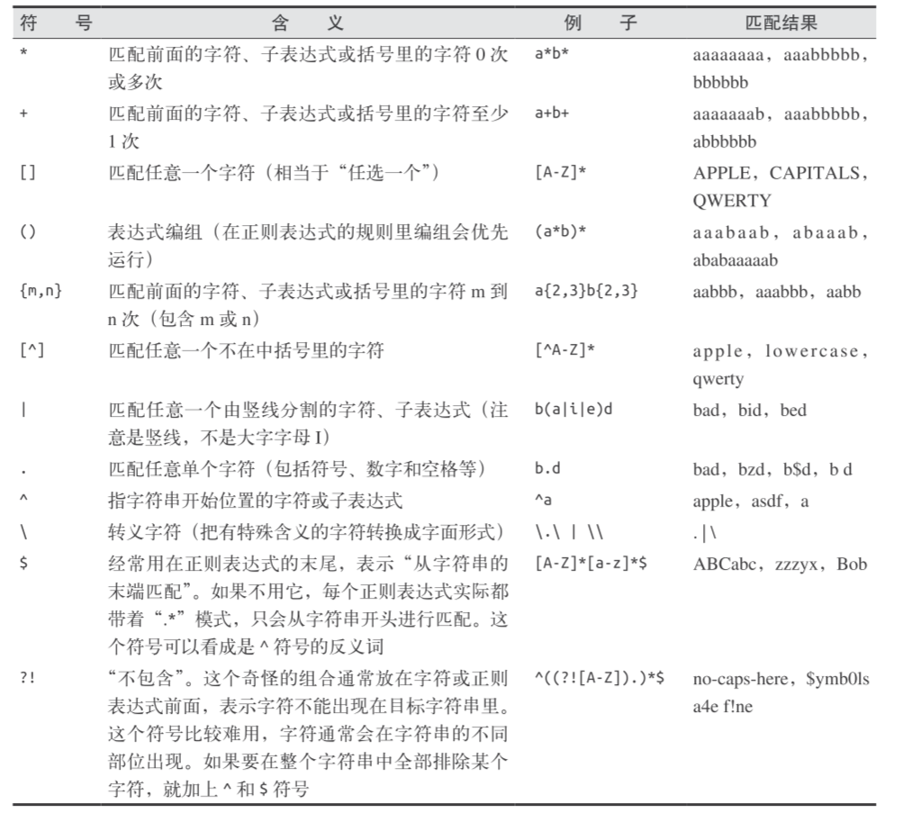

使用python完成爬虫，《python网络数据采集》学习笔记

使用时需要关闭网络代理
 

# python使用
## 使用虚拟环境安装包
**使用好处**

1. 可以避免已安装的包产生冲突，若不使用则默认安装在root下（linux中）
2. 可以打包整个环境发送给他人（项目关联的所有库单独放在一个虚拟环境）

**使用方法**

创建了一个叫作 scrapingEnv 的新环境
```shell
virtualenv scrapingEnv
```
执行activate文件，以激活新环境（部分版本是scripts目录不是bin目录）
```bash
cd scrapingEnv 
source bin/activate
``` 
激活环境后环境名称出现在命令行提示符前，此后的任意安装包或执行程序都在该环境下（如下所示）
```shell
(scrapingEnv)ryan$ pip install beautifulsoup4
``` 
退出虚拟环境
```shell
(scrapingEnv)ryan$ deactivate
```

生成依赖项清单
`pip freeze > requirements.txt`

读取并安装依赖项
`pip install -r requirements.txt`

# 爬虫
## 概述
- 先请求网络（即根据url等信息打开网页），再解析网页html（个人理解）
- 网络请求可用requests或urllib(python自带)
- 解析html和xml文档可用BeautifulSoup或lxml（处理速度很快）或[HTML parser](https://docs.python.org/3/library/html.parser.html)(python自带)
- Requests 库擅长处理复杂的HTTP请求、cookie、header（响应头和请求头）等内容
本次用到的包为urllib(进行网络请求)和BeautifulSoup（解析）,安装方式：
```python
# pip install requests
pip install beautifulsoup4
```
requests使用
requests返回对象中包含的内容
| 属性或方法            | 说明                          |
|----------------------|------------------------------------------------------------------------------------------------------|
| apparent_encoding     | 编码方式                                                      |
| close()               | 关闭与服务器的连接                                             |
| content               | 返回响应的内容，以字节为单位                                                                                                                      |
| cookies               | 返回一个 CookieJar 对象，包含了从服务器发回的 cookie                                                                                              |
| elapsed               | 返回一个 timedelta 对象，包含了从发送请求到响应到达之间经过的时间量，可以用于测试响应速度。比如 r.elapsed.microseconds 表示响应到达需要多少微秒。 |
| encoding              | 解码 r.text 的编码方式                                                       |
| headers               | 返回响应头，字典格式                                                          |
| history               | 返回包含请求历史的响应对象列表（url）                                          |
| is_permanent_redirect | 如果响应是永久重定向的 url，则返回 True，否则返回 False                        |
| is_redirect           | 如果响应被重定向，则返回 True，否则返回 False                                  |
| iter_content()        | 迭代响应                                                                     |
| iter_lines()          | 迭代响应的行                                                                                                                                      |
| json()                | 返回结果的 JSON 对象 (结果需要以 JSON 格式编写的，否则会引发错误)                                                                                 |
| links                 | 返回响应的解析头链接                                                                                                                              |
| next                  | 返回重定向链中下一个请求的 PreparedRequest 对象                                                                                                   |
| ok                    | 检查 "status_code" 的值，如果小于400，则返回 True，如果不小于 400，则返回 False                                                                   |
| raise_for_status()    | 如果发生错误，方法返回一个 HTTPError 对象                                                                                                         |
| reason                | 响应状态的描述，比如 "Not Found" 或 "OK"                         |
| request               | 返回请求此响应的请求对象                                                                                                                          |
| status_code           | 返回 http 的状态码，比如 404 和 200（200 是 OK，404 是 Not Found）                                                                                |
| text                  | 返回响应的内容，unicode 类型数据                                                                                                                  |
| url                   | 返回响应的 URL    |

参数说明
`requests.post(url, data={key: value}, json={key: value}, args)`
> url 请求 url。
> data 参数为要发送到指定 url 的字典、元组列表、字节或文件对象。
> json 参数为要发送到指定 url 的 JSON 对象。
> args 为其他参数，比如 cookies、headers、verify等。
## 异常处理
异常情况：
- 404、500抛出HTMLError
- BeautifulSoup获取的标签不存在返回None
- requests请求超时
```python
from urllib.request import urlopen 
from urllib.error import HTTPError 
from bs4 import BeautifulSoup 
def getTitle(url): 
    try:
        html = urlopen(url,timeout=5)
    except HTTPError as e: 
        # 打印异常
        print(e)
        return None
    # 请求超时
    except requests.exceptions.RequestException as e:
        print(e)
        return None

    try:
        bsObj = BeautifulSoup(html.read()) 
        title = bsObj.body.h1
    except AttributeError as e:     
        return None
    return title

title = getTitle("http://www.pythonscraping.com/pages/page1.html") 
if title == None: 
    print("Title could not be found")
else:
    print(title)
```
## BeautifulSoup方法
BeautifulSoup返回对象方法findAll()可以根据属性查找所需标签`findAll(tag, attributes, recursive, text, limit, keywords)`
- `recursive`是一个布尔变量，为`Ture`查找标签参数的所有子标签，以及子标签的子标签，默认值是`True`
- `text`用文本内容去匹配，设置`text='the prince'`是查找网页中包含“the prince”内容的标签数量
- `limit`范围限制参数,`find`等价于`findAll`的`limit`等于1时的情形 
- `keyword`选择那些具有指定属性的标签，如`findAll(id="text")`其等价于`findAll("", {"id":"text"})`
```python
html = urlopen("http://www.pythonscraping.com/pages/warandpeace.html") 
bsObj = BeautifulSoup(html)
# 获取span标签中class属性为green的所有对象
nameList = bsObj.findAll("span", {"class":"green"}) 
for name in nameList:
    # get_text()只保留文本
    print(name.get_text())

---

# 标签列表作为参数
.findAll({"h1","h2","h3","h4","h5","h6"})
# 属性列表做参数,返回所有属性为green和red的span标签
.findAll("span", {"class":{"green", "red"}})
```
## 子标签、后代标签与兄弟标签
- 子标签：一个父标签的下一级
```python
# 只取下一级
from urllib.request import urlopen 
from bs4 import BeautifulSoup
html = urlopen("http://www.pythonscraping.com/pages/page3.html") 
bsObj = BeautifulSoup(html)
for child in bsObj.find("table",{"id":"giftList"}).children:
    print(child)
---
# 与后代有区别（获取所有后代）
for child in bsObj.find("table",{"id":"giftList"}).descendants:
    print(child)
```
- 后代标签：一个父标签下面所有级别的标签
- 兄弟标签：与自己平级的标签（不包含自己），常用于表格处理中
```python
# 取与tr平级的所有标签
from urllib.request import urlopen 
from bs4 import BeautifulSoup
html = urlopen("http://www.pythonscraping.com/pages/page3.html") 
bsObj = BeautifulSoup(html)
for sibling in bsObj.find("table",{"id":"giftList"}).tr.next_siblings:
    print(sibling)
```

## 正则表达式
大多数支持字符串参数的函数可用正则表达式实现，如下抓取所有以`../img/gifts/img`开头，以`.jpg`结尾的字符串
```python
from urllib.request import urlopen 
from bs4 import BeautifulSoup 
import re
html = urlopen("http://www.pythonscraping.com/pages/page3.html") 
bsObj = BeautifulSoup(html)
images = bsObj.findAll("img",{"src":re.compile("\.\.\/img\/gifts/img.*\.jpg")}) 
for image in images:
    print(image["src"])
```
常用正则表达式
[参考链接](https://www.runoob.com/regexp/regexp-syntax.html)

## 网站信息采集
通过递归爬取一个有多页面的网站信息，策略：若获取的新链接不在全局变量集合中，则加入全局变量并爬取这个页面的信息，若已存在则跳过，python的递归限制为1000次
```python
from urllib.request import urlopen 
from bs4 import BeautifulSoup 
import re
pages = set() 
def getLinks(pageUrl): 
    global pages
    html = urlopen("http://en.wikipedia.org"+pageUrl) 
    bsObj = BeautifulSoup(html) 
    for link in bsObj.findAll("a", href=re.compile("^(/wiki/)")): 
        if 'href' in link.attrs: 
            if link.attrs['href'] not in pages: # 我们遇到了新页面
                newPage = link.attrs['href']    
                print(newPage) 
                pages.add(newPage) 
                getLinks(newPage)
getLinks("")
```
以下代码从 http://oreilly.com 开始，随机地从一个外链跳到另一个外链，但没有异常处理
```python
from urllib.request import urlopen 
from bs4 import BeautifulSoup 
import re 
import datetime 
import random
pages = set() 
random.seed(datetime.datetime.now())

# 获取页面所有内链的列表 
def getInternalLinks(bsObj, includeUrl): 
    internalLinks = [] 
    # 找出所有以"/"开头的链接 .
    for link in bsObj.findAll("a", href=re.compile("^(/|.*"+includeUrl+")")): 
        if link.attrs['href'] is not None: 
            if link.attrs['href'] not in internalLinks: 
                internalLinks.append(link.attrs['href'])
    return internalLinks

# 获取页面所有外链的列表 
def getExternalLinks(bsObj, excludeUrl): 
    externalLinks = [] 
    # 找出所有以"http"或"www"开头且不包含当前URL的链接 
    for link in bsObj.findAll("a",href=re.compile("^(http|www)((?!"+excludeUrl+").)*$")):
        if link.attrs['href'] is not None: 
            if link.attrs['href'] not in externalLinks: 
                externalLinks.append(link.attrs['href'])
    return externalLinks 

def splitAddress(address):
    addressParts = address.replace("http://", "").split("/") 
    return addressParts

def getRandomExternalLink(startingPage): 
    html = urlopen(startingPage) 
    bsObj = BeautifulSoup(html)
    externalLinks = getExternalLinks(bsObj, splitAddress(startingPage)[0]) 
    if len(externalLinks) == 0:
        internalLinks = getInternalLinks(startingPage) 
        return getNextExternalLink(internalLinks[random.randint(0, len(internalLinks)-1)])
    else: 
        return externalLinks[random.randint(0, len(externalLinks)-1)] 
        
def followExternalOnly(startingSite):
    externalLink = getRandomExternalLink("http://oreilly.com") 
    print("随机外链是："+externalLink) 
    followExternalOnly(externalLink)

followExternalOnly("http://oreilly.com")
```
可以使用scrapy完成爬虫

## scrapy使用
scrapy是一个爬虫框架，相关教程可以参考[scrapy教程](https://docs.scrapy.org/en/latest/)（另有一份[中文版](https://scrapy-chs.readthedocs.io/zh_CN/1.0/intro/tutorial.html)但不是最新且项目已废弃，可参考）这里只记录一点常用的指令和个人理解。
1. 安装
`pip install scrapy`即可
2. 创建一个命名为name的项目
`scrapy startproject <name>`
3. 创建一个命名为douban域名为movie.douban.com的spider（也可以手动创建，继承Spider类即可）
`scrapy genspider <douban> <movie.douban.com>`
4. 启动命名为name的spider
`scrapy crawl <name>`

- scrapy shell功能有助于快速了解网页内容
`scrapy shell <"https://www.amazon.com/dp/B00004CQT3/">`
- 运行quotes输出到quotes.json中，-O覆盖，-o续写
`scrapy crawl <quotes> -O <quotes.json>` 


## 处理复杂的http请求
urllib在处理复杂的http请求（比如涉及传参）时有些不足，requests为更优选择

进行post请求，并传递参数
```python
import requests
params = {'firstname': 'Ryan', 'lastname': 'Mitchell'}
r = requests.post("http://pythonscraping.com/files/processing.php", data=params)
print(r.text)
```
跟踪cookies
```python
# 此处代码不完整
r = requests.post("http://pythonscraping.com/pages/cookies/welcome.php", params) 
print(r.cookies.get_dict()) 
```
当网站cookies经常变动，可以使用session完成
```python
import requests 
session = requests.Session()
params = {'username': 'username', 'password': 'password'} 
s = session.post("http://pythonscraping.com/pages/cookies/welcome.php", params) 
print("Cookie is set to:") 
print(s.cookies.get_dict()) 
print("-----------") 
print("Going to profile page...")
s = session.get("http://pythonscraping.com/pages/cookies/profile.php")
print(s.text)
```
## 处理javascript
一般javascript不会被采集，因此对于一些动态的网站采集的数据与网站上显示的内容可能不一致，因此使用[Selenium](http://www.seleniumhq.org/)库(可直接使用指令`pip install selenium`完成安装)，一般配合无头浏览器[PhantomJS](https://phantomjs.org/download.html)(不是python库，所以安装需要在官网下载)使用，遇到Google Analytics时需要设置cookie

新版Selenium不支持phantomjs（可通过安装低版本使用`pip install selenium==2.48.0`），也可以用谷歌浏览器
 
### selenium+Chrome配置
1. 在谷歌浏览器网址中输入`chrome://version/`，查看版本信息
2. 在`https://chromedriver.chromium.org/home`网站下载对应版本的驱动
3. 将下载后的exe文件放入python路径中的Scripts即可，如`...\Python\Python38\Scripts`路径
4. 执行以下代码不报错说明成功
```python
from selenium import webdriver
driver = webdriver.Chrome()
driver.get('https://www.baidu.com')
driver.quit()
```

## 爬虫进阶
1. 修改请求头，以达到爬虫更像人
```python
headers = {"User-Agent":"Mozilla/5.0 (Macintosh; Intel Mac OS X 10_9_5) AppleWebKit 537.36 (KHTML, like Gecko) Chrome", "Accept":"text/html,application/xhtml+xml,application/xml;q=0.9,image/webp,*/*;q=0.8"}
```
使用use-gent：`iPhone; CPU iPhone OS 7_1_2 like Mac OS X) AppleWebKit/537.51.2 (KHTML, like Gecko) Version/7.0 Mobile/11D257Safari/9537.53`相当于使用移动设备访问网站（内容更简化没有广告等干扰）
2. 处理cookie
需要使用Selenium 和 PhantomJS，可以实现获取cookie或者保存cookie
```python
from selenium import webdriver 
driver = webdriver.PhantomJS(executable_path='<Path to Phantom JS>') 
driver.get("http://pythonscraping.com") 
driver.implicitly_wait(1)
print(driver.get_cookies())
```
3. 处理隐含字段
如下html网页，含有三个隐含字段，若填充并提交会被服务器判为机器人封杀，
- 第一个链接通过CSS属性设置display:None
- name="phone" 一个隐含的输入字段 
- name="email" 将元素向右移动 50 000 像素（超出电脑显示器的边界）并隐藏滚动条
```html
<html> 
<head>
    <title>A bot-proof form</title>
</head>
<style> body {
    overflow-x:hidden; } 
    .customHidden {
    position:absolute; 
    right:50000px;
    }
</style> 
<body>
    <h2>A bot-proof form</h2> 
    <a href="http://pythonscraping.com/dontgohere" style="display:none;">Go here!</a>
    <a href="http://pythonscraping.com">Click me!</a> 
    <form>
        <input type="hidden" name="phone" value="valueShouldNotBeModified"/><p/> 
        <input type="text" name="email" class="customHidden" value="intentionallyBlank"/><p/>
        <input type="text" name="firstName"/><p/> 
        <input type="text" name="lastName"/><p/> 
        <input type="submit" value="Submit"/><p/>
    </form>
</body>
</html>
```
使用selenium解决，通过link.is_displayed()自动判断
```python
from selenium import webdriver 
from selenium.webdriver.remote.webelement import WebElement
driver = webdriver.PhantomJS(executable_path='') 
driver.get("http://pythonscraping.com/pages/itsatrap.html") 
links = driver.find_elements_by_tag_name("a") 
for link in links: 
    if not link.is_displayed(): 
        print("The link "+link.get_attribute("href")+" is a trap")

fields = driver.find_elements_by_tag_name("input") 
for field in fields: 
    if not field.is_displayed():
        print("Do not change value of "+field.get_attribute("name"))
```

# 杂项
## http消息
http消息由头字段（header field）和数据字段（data field）组成，常用的头字段有
|名称|含义|实例|
|---|---|---|
|User-Agent |字符串，表示发出请求的浏览器和操作系统信息|Mozilla/5.0 (X11; Ubuntu; Linux x86_64; rv:28.0) Gecko/20100101 Firefox/28.0|
|Cookie     |变量，被网络应用用来存储会话数据和其他信息|实例略|
|Status     |表示网页请求状态|“200”（成功），“404”（文件未找到）|
## 关于《python网络数据采集》
书中还介绍了图像识别与文字处理（用于部分验证码）这部分笔记中未记录，以及很多技术比如lambda，“无头”（headless）浏览器PhantomJS等，这些没有详细展开
# 参考资料
[^1]:python网络数据采集
[^2]:[scrapy教程](https://docs.scrapy.org/en/latest/)