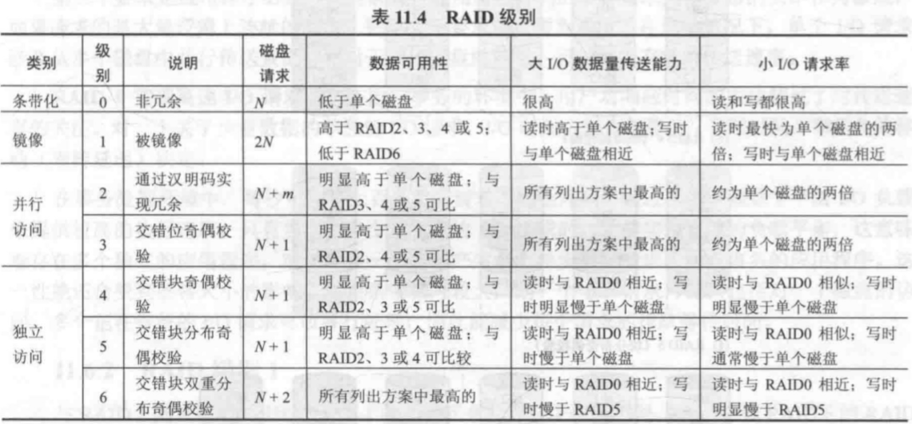


 
冯诺依曼计算机结构：存储器，控制器，运算器，输入设备，输出设备（I/O）
特点：存储程序，二进制

指令是计算机运行的最小功能单元

单位换算：
- 1秒(s) ＝1000毫秒(ms)
- 1毫秒(ms)＝1000微秒 (us)
- 1微秒(us)＝1000纳秒 (ns)
- 1纳秒(ns)＝1000皮秒 (ps)

层次结构：
- 高级语言层
- 汇编语言层
- 操作系统层
- 指令系统层
- 微体系结构层
- 数字逻辑层

指令的功能：
- 数据运算
- 数据传输
- 输入/出
- 控制
- 其他（停机，开/关中断


计算机性能：
- 吞吐率：在单位时间内完成的工作量
- 响应时间：从作业提交开始到作业完成所花费的时间（包含CPU执行时间，磁盘访问，存储器访问，输入输出等所需时间）
- 计算机性能评价主要考虑CPU性能（与系统性能有别）

CPU性能：
- **时钟周期**：用于同步的时钟定时信号，即CPU主脉冲信号宽度
- **时钟频率**：CPU时钟周期的倒数，1s内的时钟周期数量
- **MIPS**：million instructions per second
- **CPI**（cycles per instruction）：执行指令所需的时钟周期数
- 时钟周期，CPI，指令条数三个因素相互制约
- CPU执行时间=程序所含时钟周期数x时钟周期
- 程序总时钟周期数=CPIx程序所含指令条数
- 程序总时钟周期数=$\Sigma_{i=1}^{n}(CPI_{i}×C_{i})$

指令字长：指令字中二进制代码的位数

指令格式：
- 组成：操作码，操作数地址

字符集编码：
- ASCII：一个字节
- UNICODE：16位表示一个字符
- UTF8：变长字符编码

原码，反码，补码：
- 正数三者相同
- 负数
  - 原码：符号位||数的绝对值（符号位为1表示负数，后同）
  - 反码：符号位||绝对值按位取反
  - 补码：反码+1
- 原码和反码存在+0,-0，补码中只有一个0，补码比其余两者多一个数

移码：用于浮点数的阶码中，只用于表示定点整数。在原值（不是原码）的基础上加一个正的常数，将负数统一转为正数，一般是加上 $2^{n-1}$

浮点数
- 符号位
- 尾数
- 阶码（指数部分）

IEEE浮点数标准754
- 阶码使用移码， $阶码=原值+2^{n-1}-1$，阶码值**全0和全1有特殊含义**
- 尾数使用原码
- 32位单精度，1bit 符号, 8bit 阶码（移码，偏置常数127，范围`[-127,128]`）, 23bit 尾数（原码），
- 64位双精度，1bit 符号, 11bit 阶码（偏置常数1023）, 52bit 尾数


```C++
#include<bits/stdc++.h> 
using namespace std;

int main()
{
  int a=INT_MAX;
  cout<<a<<endl;//      0111,1111,1111,1111,1111,1111,1111,1111，补码
  cout<<a+1<<endl;//    1000,0000,0000,0000,0000,0000,0000,0000，在补码中该数字表示-2147483648，不存在原码和反码
  cout<<-a<<endl;//     1000,0000,0000,0000,0000,0000,0000,0001
  for(int i=0;i<32;i++){
    if(i%4==0&&i!=0){
      cout<<' ';
    }
    cout<<(((-a)>>i)&1);
  }
}
```

定点数运算：
- 加法（减法可转为加法）溢出判断
  - 符号位的进位和数值最高位的进位不同，溢出
  - 两个加数符号位与和的符号位不同，溢出
- 乘法：布斯算法

大小端：
- 大端：数据低位存在内存的高位
- 小端：数据低位存在内存的低位，低在低
- 32位整数 $(12345678)_{16}$

|内存地址|4000|4001|4002|4003|
|--|--|--|--|--|
|大端存放数据|12|34|56|78|
|小端存放数据|78|56|34|12|


检错纠错码：
- 码距：任意两个合法码之间有几个二进制位不同
- 奇偶校验码：并行数据传输，可以检错
  - 偶校验：在k位码字中增加一位校验位，k+1位码字中取值为1的位数为偶数，校验位为1
  - 奇校验：在k位码字中增加一位校验位，k+1位码字中取值为1的位数为奇数，校验位为1
- 海明校验码：并行数据传输，可以检错纠错
  - 单纠错码，SEC码
  - 单纠错和双检错码，SEC-DED码，单纠错基础上在尾部增加一位校验位，如下述例子
  - 为k个数据位，设立r个校验位，使k+r位的码字能够发现并改正k+r中的任何一位，发现k+r中的任何两位同时出错（无法改正）
    - 满足 $2^{r}>=k+r+1$ （k+r个位可能出错一位，或者无错，一共k+r+1种）可以纠正一位
    - 满足 $2^{r-1}>=k+r$ 可以检错两位（包含纠错1位）
  - 实现：P表示校验码，D表示数据位，将P1,P2,P3...依次安排在2的幂次方位上，其余顺次放D1,D2,D3等，如
    ```
    P1 P2 D1 P3 D2 D3 P4
    1  2  3  4  5  6  
    3=1+2
    5=1+4
    6=2+4
    故P1对D1和D2校验；P2对D1和D3校验；P3对D2和D3校验
    编码时：
      P1=D1^D2, P2=D1^D3, P3=D2^D3
      P4是总校验位, P4=D1^D2^D3^P1^P2^P3
    译码时（给定海明码时计算故障码）：，将接收的校验位P'与根据接收数据计算出的校验位P''按位取异或，得到故障字S
      S1=P1^D1^D2
      S2=P2^D3^D1
      S3=P3^D3^D2
      S4=P4^P3^P2^P1^D3^D2^D1
      若无错则S4 S3 S2 S1全为0
      1位错，    S4为1，其余不为000
      2位同时错, S4为0，其余不为000
    ```
- 循环冗余校验码：串行数据传输

运算结果的状态
- C：CF（进位标志）
- Z：ZF（零标志位）
- V：OF（overflow溢出标志位）
- S：SF（符号标志位）

浮点数运算：
- 加减运算5个步骤
  - 对阶，阶码小的数尾数右移阶码差值位
  - 尾数加减
  - 规格化处理
  - 舍入操作（可能在此规格化处理
  - 判断结果正确性
- 注：浮点数的加减不满足结合律，并且也不能进行相等比较

---

指令系统
- 指令使计算机运行的最小的功能单元
- 功能和分类：
  - 算术与逻辑运算指令
  - 位移操作指令
  - 数据传送指令
  - 输入输出指令
  - 转移指令
  - 子程序调用与返回指令
  - 堆栈操作指令
  - 其他指令
- 组成：操作码，地址码
- 指令字长：一条指令的二进制位数

定长操作码：操作码位数固定不变
变长操作码：一地址，二地址，三地址，多地址等

寻址方式：
- 立即数寻址：操作数在地址字段直接给出,`EA=A`
- 直接寻址：地址码为操作数在存储器中的地址,`EA=MEM[A]`
- 寄存器寻址：地址码为寄存器编号（地址），寄存器中存放操作数E`A=Reg[A]`
- 寄存器间接寻址：地址码为寄存器编号（地址），寄存器存放内存编号，内存中存放操作数,`EA=Reg[MEM[A]]`
- 变址寻址：操作数地址由变址寄存器的内容和变址偏移量相加得到`EA=[Rx]+A`
- 相对寻址：由程序计数器PC内容和相对寻址偏移量相加得到，偏移量用补码表示,`EA=PC+A`（可以实公共子程序的浮动）
- 间接寻址：地址码给出操作数地址的地址,`EA=MEM[MEM[A]]`
- 基址寻址：基址寄存器内容和地址码中的偏移量相加得到操作数地址`EA=[R]+bias`
- 堆栈寻址：

指令系统的两种设计思路：
- RISC（精简指令集）：通用寄存器较多，采用**组合逻辑电路控制**，使用Load/Store型指令设计风格，典型的精简指令集MIPS
- CISC（复杂指令集）：通用寄存器较少，采用**微程序控制**，指令周期长

MIPS指令格式，均为**32位**宽度：
- 指令格式：
  - 寄存器型（R）：6位OP，5位rs，5位rt，5位rd，5位shamt，6位funct。操作码OP为“000000”，操作类型由funct字段指定
    - 双目运算类指令，rs和rt内容对应第一和第二源操作数，结果给rd
    - 移位指令，对rt内容移位，结果送rd，移位数由sa字段给出
    - 寻址方式只有寄存器寻址
  - 立即数型(I):6位OP，5位rs，5位rt，其余address/immediate
    - 双目运算类指令，将rs内容和立即数分别作为第一和第二源操作数，结果送rt
    - Load/Store指令，则将rs内容和立即数符号扩展后（符号位扩展，最高位符号是什么扩展什么；0扩展，全部补0）的内容相加作为存储单元地址，Load指令将内存单元内容送rt，Store将rt内容送内存单元
    - 分支指令，对rs和rt内容进行指定运算，根据运算结果，决定是否转到转移目标地址处执行，转移目标地址通过相对寻址方式得到
    - 有寄存器寻址，立即数寻址，相对寻址，基址，变址寻址
  - 转移性(J):6位OP，其余target。
    - 无条件跳转指令，指令中给出的26位是直接地址，将PC的高4位拼上26位直接地址，最后添加两个“0”（字节对齐地址必为4的倍数）`PC[31:28]||target[25:0]||[00]`即可得到32位转移目标地址
    - 只有直接寻址
- 操作数寻址方式：
  - 基址加16位位移量的访存寻址
  - 立即数寻址
  - 寄存器寻址
- 指令特点：
  - 指令长度固定32位
  - 寄存器位置固定（目的寄存器位置有所变动，但源寄存器位置固定）

MIPS常见指令
```
1. addu/subu 
  - addu rd rs rt # R[rd]=R[rs]+R[rt]
  - subu rd rs rt # R[rd]=R[rs]-R[rt]
2. ori 
  - ori rt rs imm # R[rt] OR ZeroExt(imm)，ZeroExt表示0扩展
3. load/store
  - lw rt rs imm # Addr=R[rs]+SignExt(imm), R[rt]=MEM[Addr]
  - st rt rs imm # Addr=R[rs]+SignExt(imm), MEM[Addr]=R[rt]
4. beq
  - beq rs rt imm # if R[rs]=R[rt] then PC=(PC+4)+SignExt(imm) else PC=PC+4 (一个指令4字节，故+4，若写作+1表示加一个指令字)
  - bne rs rt offset # if R[rs]≠R[rt] then branch
5. Jump
  - j target # PC[31:28]||target[25:0]||[00]
```
指令的执行过程：
- 读取指令      取指（IF,instruction fetch）  IM、PC、总线
- 指令译码      译码（ID,instruction decode）  寄存器组，控制信号生成部件
- 执行运算      执行（EX）  ALU
- 存储器读写    访存（MEM） DM(data memery)、总线
- 写回          写回（WB）  寄存器组

MIPS中：
- ID完成所有的读操作
- WB完成所有的写操作

---

单周期CPU：全部指令都是用一个CPU周期完成，CPU周期时间固定
  - 缺点：信号竞争，地址、数据和“写使能”之间存在竞争，组成部件利用率不高

多周期CPU：
  - 将指令执行的过程分解为多个步骤，**每个步骤的时钟周期固定**
  - 有锁存器
  - 两种控制器：
    - 硬连线控制器（组合逻辑控制器）
    - 微程序控制器：采用控制存储器存储每条指令所需的控制信号
  - 部件利用率偏低
  
指令流水线CPU：
- 计算机各个部件均可使用流水线（指令流水线，操作部件流水线，宏流水线）
- 有锁存器（保存本流水段的结果）
- 每条指令5个时钟周期（指令执行过程）
- 性能指标：
  - （最大）吞吐率：单位时间内，流水线所完成指令的数量，等于CPU时钟周期的倒数
  - 加速比：与串行执行相比速度提高的比率

寄存器可以同时读和写
在访存中分为指令存储器（IM）和数据存储器（DM）避免存储器争用的冲突

三种冲突：
- **结构冲突**，硬件资源冲突
  - 暂停流水线，插入等待周期，流水线性能降低。软件上，在编译时插入空操作指令；硬件上，硬件阻塞阻止后续指令执行，插入气泡
  - 增加资源，解决资源冲突
- **数据冲突**，也称为局部冲突，一条指令依赖于前面指令的执行结果
  - **数据冲突分类**，按照指令读写寄存器的顺序对数据冲突进行分类。i，j指令依次进入流水线
    1. **写后读**（RAW）：在i写入结果前j读取寄存器
       - 旁路技术，需要用到之前指令的数据，从流水线的锁存器中取数据放入。指令的IF，ID照常执行，直到EXE前才从锁存器取数据
       - 插入空操作指令nop
       - 插入气泡
    2. **写后写**（WAW）：j在i写入前写入寄存器，写入顺序错误（MIPS指令流水中不会发生WAW冲突）
    3. **读后写**（WAR）：j在i读取前对寄存器写入（MIPS中不会发生WAR冲突）
  - **数据冲突检测**，
    - EXE段冲突检测点：当前指令的ID/EX段和上一条指令的EX/MEM
    - MEM段冲突,
  - 解决方法。数据旁路，暂停流水线，编译器调度（也称为静态调度，调整指令顺序），动态调度（硬件动态调整指令执行顺序，异常处理不精确）
- **控制冲突**，全局冲突，分支等需要改写PC的指令造成的冲突（主要讨论条件跳转）
  - 解决方法
    - 暂停流水线。直到有正确的转移地址才继续。直到分支指令达到MEM段确定新的PC值。可以尽早算出分支是否转移和转移后的PC
    - 预测分支失败。顺序执行下一条指令，预测失败后清除错误启动的指令
    - 预测分支成功
    - 动态预测。分支目标缓存技术，将分支的转移成功的分支指令及其目标地址放在缓冲区保存，即分支历史记录表（BHT）。可以使用1位预测位，或**2位预测位**（需要连续预测失败2次，才改变预测方向，对多重循环预测准确率有提高）
    - 编译器处理（静态调度，延迟槽）。本质是通过指令调度改变指令执行顺序。有三种调度策略。MIPS处理器的分支延迟槽数为1（RISC-V不采用该技术）

| **调度策略** | **所受限制**                 | **对流水线性能的影响**                  |
|----------|--------------------------|---------------------------------|
|  来自分支前   | 被调度指令与分支指令不相关            |  可以提高流水线性能                      |
|  来自目标地址  |  转移失败需要清除影响              |  转移成功可以提高流水线性能。由于需要复制指令可能加大程序空间 |
|  来自延迟槽后  |  若分支转移成功，被调度指令对程序的执行没有影响 |  分支转移失败时可以提高流水线性能               |

---

多周期CPU下MIPS指令执行步骤：
- 取指：1步
- 在取指之后
  - J型指令，`PC[31:28]`与target拼接，1步
  - 相对转移I型指令（beq），读寄存器堆，ALU运算，2步
  - R型指令，读寄存器堆，ALU运算，结果写回，3步
  - 读内存I型指令，读寄存器堆，ALU算地址，读内存数据到DR，把DR内容写入寄存器堆，4步


---

层次存储器
- 按工作性质/存取方式分类
  - 随机存取存储器（Random Access Memory, RAM）
  - 顺序存取存储器（Sequential Access Memory, SAM）
  - 直接存取存储器（Direct Access Memory, DAM），有随机的部分也有顺序的部分
  - 相联存储器（Associate Memory, AM，CAM）
- 只读存储器（Read-Only Memory, ROM）可持久化存储，与硬盘类似

存储器的设计目标：大容量，高速度，低成本，高可靠性

动态存储器（DRAM），静态存储器（SRAM）：
- DRAM破坏性读出 ，需定期刷新（有集中刷新，分散刷新，异步刷新），快速分页组织；DRAM和SRAM都是**易失性**

| | SRAM | DRAM |
| -- | -- | -- |
| 存储信息 | 触发器 | 电容 |
| 破坏性读出 | 非 | 是 |
| 需要刷新 | 不要 | 需要 |
| 送行列地址 | 同时送 | 分两次送 |
| 访问速度 | 快 | 慢 |
| 集成度 | 低 | 高 |
| 发热量 | 大 | 小 |
| 存储成本 | 高 | 低 |

Flash存储器：
- 高密度非易失性读写存储器，兼有ROM和RAM特点，功耗低，集成度高，不需要后备电源
- 写入一页的某一块前需要擦除整个块

连续编址与交叉编址

---

Cache
- 设置于主存和CPU之间的存储器，用SRAM实现
- 与CPU运行速度一致，对程序员透明
- 命中率（HR）：命中次数/访问次数
- **Cache总位数**，包含**有效位**（一般一位），**标记位**（主存地址中的标记位）和**数据区**；Cache容量只有数据
- **全相联映射**。主存的字块可以和Cache的任何字块对应，利用率高，标志位较长。主存地址为**标记+块内地址**
- **直接映射**。主存的字块只能和Cache的固定字块对应，利用率低，标志位短，比较成本低。主存地址为**标记+索引（行号）+块内地址**。通过索引直接定位Cache块，通过标记对比是否是所需要的块
- **N组相联映射**。每一组有$N$行，二路组相联（Cache分为多个组，每组有两行）。映射到组后策略与全相联策略相似。主存地址为**标记+cache组号+块内地址**


|名称|组成|
|--------|------------|
| 全相联映射  | 标记+块内地址    |
| 直接映射   | 标记+索引+块内地址 |
| N组相连映射 | 标记+组号+块内地址 |

块替换策略
- 直接映射不需要替换策略
- 全相联映射，主存中的一块可以映射到Cache中的任意一个位置
- N路组相联映射，主存中的一块可以选择映射到Cache中的N个位置
- 对于全相联映射和N路组相联映射有LRU（硬件实现复杂，需要两位），FIFO，RAND（随机替换）

一致性保证
- 写直达（write through）。强一致性保证，效率低，在Cache命中同时修改Cache和主存的内容
- 拖后写（write back）。弱一致性保证，替换时再写（cache中需要有一位修改位）

提高存储访问的性能：
- 提高命中率，缩短缺失时的访问时间，提高Cache本身的速度

Cache缺失的原因：
- 必然缺失。首次访问数据块。预取
- 容量缺失。活动数据集超过Cache大小。增加Cache容量可以缓解
- 冲突缺失。多个内存块映射到同一Cache块。增加相联组或Cache容量
- 无效缺失。其他进程修改了主存数据。

影响命中率的因素：Cache容量，Cache块大小，地址映射方式，替换算法，多级Cache

Cache接入系统的体系结构：
- 侧接法，与入出设备类似，结构简单，成本低；不利于降低总线占有率
- 隔断法，提高总线利用率，支持总线并发操作；结构复杂

磁盘
- 访问方式：随机访问，串行访问（访问时间与存储位的物理位置有关）
- 主要指标：存储密度（单位长度或密度磁层表面所存储的二进制信息），存储容量，寻址时间，数据传输率，误码率，价格
- 访问过程：寻道，寻找扇区，数据传输
- 磁盘访问时间=寻道时间+旋转延迟（旋转半圈的时间）+传输时间+磁盘控制器延迟

RAID
- RAID0。没有冗余，可靠性差，不算真正的RAID；适合数据请求量大的情况
- RAID1。四块主盘，四块辅盘，写操作进行两次，可靠性高
- RAID2。驱动器必须同时旋转，
- RAID3。驱动器之间必须严格同步，采用奇偶校验生成单个冗余盘
- RAID4。冗余盘存放奇偶校验位，采用大数据块交叉方法
- RAID5。减少校验盘负载，将校验位循环均匀分布在所有驱动器上
- RAID6。二维校验
- RAID7。使用了Cache


固态硬盘可以随机访问

---

异常和中断的区别：异常来自CPU，可能返回应用程序，可能不返回，若返回，从异常指令A开始执行；中断来自外部设备，中断返回应用程序，执行被中断指令的下一条指令

- 内部异常：可分为故障，自陷，终止，常采用软件识别
- 外部中断：采用软件识别或硬件识别方式

MIPS异常和中断处理流程：
1. 异常和中断检测
2. 异常和中断响应：保存断点，EPC和程序状态字
3. 异常和中断处理
4. 异常和中断返回：返回到断点处继续处理

状态寄存器SR（status register）：32位，其中EXL
Cause寄存器：查看ExcCode确认何种异常

异常处理过程：
1. 保护断点和程序状态
2. 识别异常事件并转异常处理

MIPS异常处理的流程（**1-4为硬件，5-10为软件**）：
1. 设置EPC指向重新开始的地址（**保存断点**）
2. 设置SR(EXL)位，强制CPU进入内核状态，并禁用中断（**关中断**）
3. 设置Cause寄存器（**保存异常原因**），地址异常时，BadVAddr也要设置
4. 从异常入口点取指令，之后交给软件处理
5. 通过k0和k1寄存器引用一段可以保存其他寄存器的内存空间来实现（**保护现场**）
6. 区分不同的异常（**读取异常原因，识别中断源**），Cause寄存器的ExcCode域
7. 处理异常
8. 恢复寄存器（**恢复现场**），清零Cause寄存器
9. ERET指令返回EPC指向的地址（**恢复断点**）
10. ERET指令修改Status寄存器（**开中断**）

IO设备
- 编址方案：
  - 独立编址。不占内存空间，只能使用专门的IO指令
  - 统一编址。可利用存储器的寻址方式寻址IO端口；IO端口占用存储空间
- 输入输出方式
  - **程序直接控制**。CPU循环等待，成本低，效率低，严重占用CPU资源，
  - **程序中断方式**。CPU和外设同时工作，提高CPU效率。适用于传输速度不高，传输量不大
  - **直接存储访问**（DMA）。用于IO设备和主存储器之间的直接数据通路的硬件，传输过程由DMA控制。DMA的**数据传送过程**：CPU预处理，数据传输，后处理。与设备**一对一服务**，CPU打扰适中，不适用大量高速设备的管理
    - DMA的**工作方式**
      - 周期挪用（周期窃取）。DMA总线优先权比CPU高
      - 独占总线
    - DMA采用虚拟地址：DMA需要进行虚实地址转换；DMA采用实地址，实地址不连续
    - Cache一致性问题（主存和Cache不同步）。解决方法：IO通过Cache进行；Cache刷新（IO读时操作系统使某些Cache块无效，使Cache进行一次写回操作）；通过硬件机制选择被刷新或无效的Cache块
  - **IO通道**。代替CPU管理外设的独立部件，**一对多连接**，可并行工作
    - 通道类型：字节多路通道（分时处理）；选择通道（选择一台外设独占整个通道）；数组多路通道（前两者结合）
  - **IO处理机**（IOP）。通道方式的进一步发展

点阵输出设备
- CRT显示器（阴极射线管），`带宽=分辨率*3B(真彩色)*总线速率（如50场/秒）`

总线
- 单总线计算机（主板总线）：简单成本低；速度慢
- 双总线系统：处理器-主存总线，与外设通过总线适配器连接
- 三总线系统：
- 异步总线传输：控制信号作为总控信号，使用握手协议
- 同步总线传输：使用共同的时钟信号，总线距离必须足够短
- 多个总线主设备，需要总线仲裁（分为集中仲裁和分布仲裁），集中仲裁：菊链仲裁（低优先级可能得不到总线使用权）；集中平行仲裁（高速输入输出总线）。分布仲裁：通过自我选择进行分布式仲裁（）；碰撞测试

增加总线带宽
- 增加总线宽度（每个周期传送数据量提高）
- 分别设置数据总线和地址总线
- 采用成组传送方式（）。复杂度提高，后续总线请求等待时间增加
- 多主设备总线提高事务数量（仲裁重叠）

总线带宽：$B=W*\frac{F}{N}$，其中W总线宽度（同时并行传送的数据），F为总线时钟频率，N为传送一次所需的时钟周期数

PCI总线
- 集中平行仲裁

USB（通用串行总线）特点：
- 即插即用
- 热插拔
- 可扩充，可扩充高达127个外部USB设备
- 高速传输，速度可达480Mbps
- 连接能力强，采用菊花链形式将外设连接起来