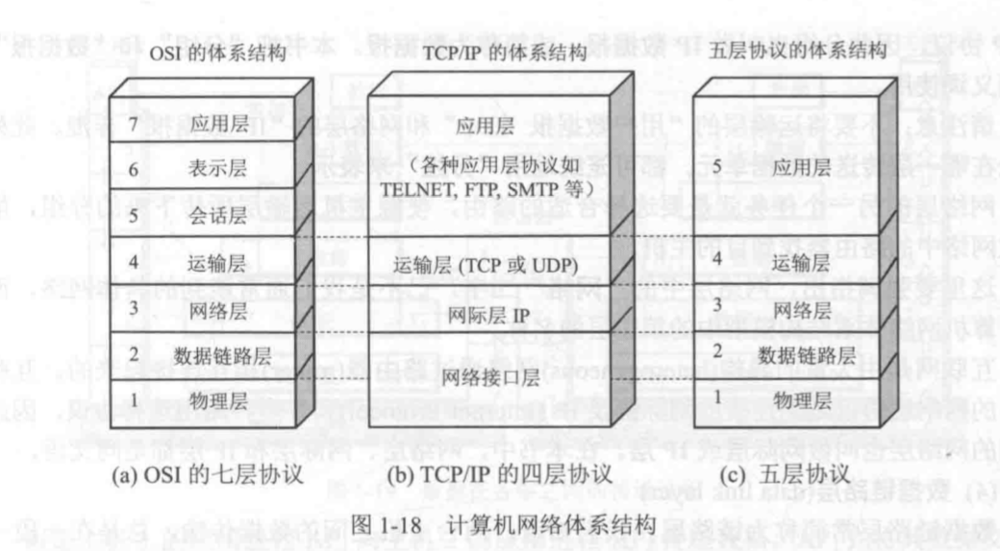


计算机网络复习笔记
 

访问信息的模型：
- 客户端-服务端(C/S)
- 对等网络模型，没有固定的客户和服务器

网络的用途：
- 信息访问
- 通信
- 电子商务
- 娱乐
- 物联网

按空间距离划分：
- 局域网LAN（Local Area Networks），有线LAN和无线LAN，主要采用广播。共享传输信道；地理范围有限
- 城域网MAN(Metropolitan)，采用交换
- 广域网WAN(Wide)，采用交换
- 个域网PAN 

局域网中用到的拓扑结构：
1. 总线型（总电缆断开，整个网络瘫痪
2. 环型（总电缆断开，整个网络瘫痪
3. 星型
4. 网状


通信方式：
- 交换式通信
  - 经过交换设备转发，关键技术是路由选择，有star,ring, tree, complete等结构
- 广播式通信
  - 多台计算机共享通信线路，任一计算机发出的信息可被其他计算机接收，关键技术是通道分配，有bus,ring结构
    - 通道分配：
      - 静态分配，分时间片，控制简单，通道利用率低
      - 动态分配，各站点动态使用通道，通道利用率高，控制复杂，有集中式和分布式两种通道分配方法

交换（动态的接通或断开通信线路）方式分类：
- **电路交换**：实时信息和模拟信号传输
  - 三个阶段：建立电路（物理电路），传输数据，拆除电路
  - 发送数据前建立**点对点**物理通路，数据传输延迟小
  - 传输效率低
  - 一般采用时分复用
- 报文交换（计算机中不使用）：使用于带宽高，可靠灵活，延迟大
  - 信息以报文（逻辑上完整的信息段）为单位进行存储转发
  - 线路利用率高，中间节点缓冲大，延迟时间长
  - 使用统计复用
- **分组交换**：缩短延迟，满足一般实时信息传送
  - 比报文小的信息段，可定长也可变长
  - 易于重传，可靠性高，每个分组包括原地址和目的地址；额外信息增加
  - 分为虚电路分组交换和数据包分组交换
    - 虚电路分组交换：电路交换与分组交换结合，分为建立（逻辑上的电路，选择路由），传输，拆除三个阶段，分组头不需要包含完整的地址信息


服务（层间交换信息必须遵守的规则）分类：
- 面向连接的服务，先建立连接，使用连接传输数据
- 无连接的服务，使用服务传输数据，每个包独立进行路由选择

---

服务原语：
- 请求
- 指示
- 响应
- 确认

OSI参考模型：
```
1. 应用层
2. 表示层（在5层中包含于应用层），解释交换数据的含义使用户看得懂，包括数据压缩，数据加密，数据描述
3. 会话层（在5层中包含于应用层），定义数据交换的定界
4. 传输层（只支持面向连接的通信）
5. 网络层（支持无连接和面向连接的通信）
6. 数据链路
7. 物理层
```

TCP/IP(前身是ARPANET)参考模型：
```
1. Host-to-Network，物理层与数据链路合称
2. Internet层（网络层，只支持无连接）
3. 传输层（支持两种通信模式）
4. 应用层
```


- 时域观：模拟信号（信号连续且光滑），数字信号（一段时间内是一个恒值，突变为另一个恒值），横轴是时间，
- 频域管：横轴是频率


性能指标
- 速率：数据的传送速率，也称比特率，单位bit/s
- 带宽：
  - 信号的频带宽度，单位Hz
  - 某通道的最高速率，单位bit/s
- 吞吐量：单位时间通过某网络的实际数据量，单位bit/s
- 时延
  - 发送时延：发送数据帧所需时间=帧长/发送速率（bit/s）
  - 传播时延：在信道中传播一定距离所需时间=信道长度/信道上的传播速率（m/s）
- 往返时间RTT：

---

比特率（传输速率，每秒传输二进制的位数）：
- 波特率：信号每秒改变的次数，单位波特（信号在一个给定的等级停留0.001s，系统工作在1000波特）
- 信号等级：有n个信号等级，则一次可以表示$log_{2}n$个比特
`比特率=波特*log2(信号等级数量)`

计算最大传输速率：
1. **奈奎斯特定律**：
  $f_{max}$是复合信号中的最高频率，采样率=$2*f_{max}$
  任意信号通过一个带宽为H Hz的低通滤波器，每秒采样2H次就可以完整的重现该信号，信号电平分为V级，**最大传输速率**=$2Hlog_{2}(V)$ (bps)

1. **香农定理**：
  在奈奎斯特定理基础上考虑随机噪声，用信噪比衡量随机噪声出现的大小（信号功率S与噪声功率N之比）$10log_{10}\frac{S}{N}$，单位分贝，注意区分题目给出的是**S/N**还是**、有分贝单位的数值**
  带宽为H Hz，信噪比为S/N的任意信道，**最大数据传输速率**=$Hlog_{2}(1+\frac{S}{N})$ (bps)

---

四种特性：机械特性；电气特性；功能特性；过程特性

物理层有关的传输方式：
- 通信方式：
  - 单工：信息只能单向传输
  - 半双工：信息可双向传输，但同一时刻是单向的
  - 全双工：可同时双向传输
- 连接方式：
  - 点对点，点到多点
- 位传输方式：
  - 串行，并行

物理层的传输介质：
- 双绞线：模拟传输，数字传输均可用
- 基带同轴电缆：数字传输
- 宽带同轴电缆：模拟传输
- 光纤：单模光纤（长距离），多模光纤（短距离）

物理层设备：
- 中继器：延长信号传输距离
- 集线器：类似多接口的转发器，每个接口用非屏蔽双绞线与适配器相连（连接的物理结构不是总线型，而是星型），可采用多集线器的级联结构

传输方式：
- 同步传输：接收方知道每一位信号的开始及其持续时间
- 异步传输：

使用数字信号
- 优点：价格便宜，对噪声不敏感
- 缺点：易受衰减，频率越高，衰减越厉害

常用的编码方式：
1. 不归零制码（Non-Return Zero）：低位表示“0”，高位表示“1”
2. 曼彻斯特编码（相位编码）：每一位中间从低跳高表示“0”，从高跳低表示“1”，以太网采用
3. 差分曼彻斯特码：每一位开始时有跳变表示“0”，无跳变表示“1”


**数字数据**（离散值）的模拟传输三种调制技术：
1. 幅移键控法（调幅）(ASK, Amplitude-shift keying)
2. 频移键控法（调频）(FSK, Frequency-shift keying)
3. 相移键控法（调相）(PSK, Phase-shift keying)

**模拟数据**（连续值）的数字传输（解决模拟数据数字化的问题，也称为脉冲代码调制PCM）：
1. 脉冲编码调制
2. $\delta$调制,(缺点：编码速度跟不上变化太快的信号)

传输媒介：
- 导引性传输媒介
  - 双绞线（屏蔽双绞线；无屏蔽双绞线）
  - 同轴电缆
  - 光缆，常用的三个波段中心（850nm，1300nm，1550nm）
- 非导引型（自由空间传播）
  - 无线电波

多路复用技术（信道静态分配）：
1. 时分复用（TDM, time division multiplexing）：轮流工作。T1载波1.536MB/s，分成24个信道
2. 频分复用（FDM, frequency division multiplexing）：同时使用，通过频率分隔。
3. 波分复用（WDM, wavelength division multiplexing）：光纤中的频分复用
4. 码分复用（CDM, code division multiplexing）：能够提取期望信号（不同语种之间的人交流）
   1. 码分多址CDMA：每个站指派一个m bit码片序列，发送1则发送该序列，发送0则发送该序列反码。解析时用接收码片点乘站的码片/m即可得到发送的数据是什么（结果为-1，发送的是0，结果为0，没有发送，结果为1，发送的是1）

（信道动态分配）
多路访问协议：
- **ALOHA协议**
  - 纯ALOHA协议：数据发到信道若有冲突等待一段时间（随机的）后重发
  - 分槽ALOHA协议：信道分为离散的时间槽，槽长为一个帧所需的发送时间，其他与纯ALOHA相同
- **载波监听多路访问协议CSMA**（Carrier Sense Multiple Access Protocols）
  - 在发送之前监听信道有无载波，有则不发；多路访问
  - 1-坚持型CSMA：发送前监听，信道空闲则发，否则监听至信道空闲再发，出现冲突等待一段时间（随机的）再开始发送过程
  - 非坚持型CSMA：发送前监听，信道空闲则发，否则等待一段时间再发，出现冲突等待一段时间（随机的）再开始发送过程。减少冲突概率，信道空闲时间增加
  - p-坚持型CSMA：适用于分槽信道，发送前监听，信道空闲以概率p发送，1-p延迟到下一时槽，信道忙则等待下一个时间槽，重新开始发送，若冲突等待一段时间（随机的）重新开始
- **带冲突检测的载波监听多路访问协议CSMA/CD**
  - 使用CSMA协议发送数据，站点检测到有冲突就取消传送
- **无冲突协议**
  - 位图协议（实际发送前先广播发送请求）: 利用率d/(d+N)
  - 令牌环协议
  - 二进制下数法：利用率d/(d+log2N)
- **有限竞争协议**
  - 对战分组，组内竞争
  - 适应树搜索协议
- **无线局域网协议**
  - 只有一个信道，存在隐藏站点问题和暴露站点问题
  - MACA（Multiple Access with Collision Avoidance）：发送前发送站点与接收站点进行RTS（request to send）与CTS(clear to send)保证各自周围站点在一段时间内不发送数据
  - MACAW：对MACA进行改进。传输成功的数据帧要产生确认帧；增加发送站的载波监听；若冲突每个数据流执行后退算法；拥塞时站点间交互信息

二进制指数后退算法：
- 冲突后的时间划分为**51.2微秒**的时槽（10Mb/s的以太网）
- 第i次冲突，i<=10时，在[0, $2^{i}-1$]间随机选择一个等待时间槽数再开始重传；i>10后在[0, $2^{10}-1$]间随机选择一个等待时间槽数再开始重传
- 16次冲突后发送失败，报告上层
---

**数据链路层**（如何在有差错的线路上，进行无差错传输）：从网络层获取数据包（分组）把数据包封装成帧
在网络层的分组没有长度限制，确认和重传比较麻烦
为网络层提供三种服务：
- 无确认无连接服务，源机器向目标机器发送独立的帧，目标机器不对这些帧确认，适用于实时业务，错误恢复留给上层（不检测丢帧现象）
- 有确认无连接服务，未使用逻辑连接，发送的每一帧都要单独确认，适用于不可靠的信道（无线系统）
- 有确认有连接服务，三个阶段建立，传输，释放

完成的功能有：
- 向网络层提供接口
- 处理传输错误
- 调节数据流（确保慢的一方不会被快速发送的一方淹没）
- 组帧

组帧的方法：
- **字符计数**法：计数出错后本帧及之后的帧都有影响（目标方不知道下一帧从哪开始），帧头是整个帧的字符个数（包括自己）
- 带**字符填充**的字符定界法：使用标志字节（flag byte）作为起始和结束分界字符，如果在数据中有标志字节，通过字符（字节）填充在之前插入一个转义字符，缺点是依赖于8位字符
- 带**位填充**的标记定界法：转换密度小，USB采用该方法，一帧的长度取决于数据内容
- **物理层编码**违例法：适用于物理层编码有冗余的网络，容易找到帧的开始和结束，不需要填充数据

差错出现的特点：随机，连续突发
处理方法：
- 纠错码：在数据块中添加冗余信息使得接收方能够判断数据是否有错，并**纠正错误**
  - 海明距离（两个码字之间不同的对应比特位数目,0000000000与0000011111的海明距离为5）
  - 广泛应用于无线链路
- 检错码：在数据块中添加冗余信息使得接收方能够判断数据是否有错，但**不能判断错在哪**，纠错码适用于无法重传的情况
  - 循环冗余校验码（CRC，Cyclic Redundancy Check）：发送T(x)，接收`T(x)+E(x)`,`E(x)≠0`（生成多项式G(x)事先约定好），若`(T(x)+E(x))%G(x)=0`（由于T(x)/G(x)一般是0，所以只需要看E(x)/G(x)是否为0）不会发现差错，否则可发现（有四个国际标准*生成多项式*）
  - CRC的详细过程：
    - 假设：生成多项式为G(x)，r次冪 (即r+1位)；信息多项式M(x)
    - 发送端：在帧的低位端加上r个0位，传送 $T(x)=M(x)x^{r} – R(x)$ ，其中R(x)为 $x^{r}M(x)/G(x)$ 的余数
  - 铜线和光纤上应用

注：加减法等同于异或

---

物理层与数据链路层在个特殊的IO电路中的一个处理器上运行，网络层在主CPU上运行

滑动窗口协议：捎带（延迟待发确认，与下一个待发数据帧一起发送），可在实际环境下工作，可以充分利用信道带宽，但等待时间的确认复杂。在接收到确认之前窗口大小不变。[参考资料](https://zhuanlan.zhihu.com/p/482716790)
- 一比特滑动窗口协议（**停等**协议）：窗口大小为1，传输效率低
  - 信道带宽`b` bit/s，帧长度`L`比特，往返传输延迟`R`秒则利用率为$\frac{L/b}{L/b+R}$，采用管道化技术发送多帧后再等待确认，但误码率将升高
- **退后n帧**重传（go back n）：接收窗口大小为1，发送窗口为n，接收方采用累计确认。如果之前的确认失败，将不动等待超时，但会造成不必要的重传，发送窗口尺寸<序号个数。当用n比特进行分组的编号时，若接收窗口等于1，则**发送窗口不超过**$2^n-1$时
- **选择重传**（SR）：无不必要的重传，接收端需要缓冲区。发送窗口<=接收窗口，接收窗口的最大值（maxseq+1）/2；发送窗口>接收窗口时，发送窗口+接收窗口<=序号个数，不具有累计确认的作用

常用的数据链路层协议
- 级数据链路控制规程，HDLC（High Level Data Link Control）
  - 帧类型：信息帧，监控帧，无序号帧
- X.25 LAP(Link Access Procedure),LAPB(Balanced)是HDLC的子集，面向比特
- PPP（Point to Point），面向字节，完善了SLIP协议，包括LCP（链路控制协议，Link Control Protocol）和NCP（网络控制协议，Network Control Protocol）（包含了物理层和网络层内容）
  - 异步传输：转义字符定义为0x7D，采用字节填充。填充规则如下：
    - 0x7E->0x7D,0x5E 
    - 0x7D->0x7D,0x5D
    - 数值小于0x20的字符->0x7D,该字符
  - 同步传输：使用零比特传输，发现有5个连续的1，填入一个0

LLC逻辑链路控制子层(Logical link Control)：为网络层提供接口
MAC介质访问控制子层(Medium Access Control)：与传输介质有关的内容放在MAC层

802.3基带系统都使用曼彻斯特编码
IEEE 802.3
- 目标和源地址字段6字节
- 帧长度域2字节
- 数据0-1500字节
- 填充0-46字节
- 校验和CRC校验4字节

万兆以太网
- 10GE不使用CSMA/CD协议只工作在全双工方式，不使用铜线只使用光纤作为传输介质

802.11
- 未采用CSMA/CD协议，支持DCF(Distributed Coordination Function，分布式协调功能)和PCF(Point Coordination Function，点协调功能)

网桥技术：工作在数据链路层的一个网络互连设备，在互连的LAN间实现帧的存储和转发，也称为交换机
- 网桥混杂方式工作（接收所有帧），地址/端口表为空时，使用洪泛方式转发帧（全部转发），转发过程中使用逆向学习算法收集MAC地址（分析**源MAC地址**得到MAC地址与端口对应关系写入地址/端口表）；定时更新
- 帧的路由过程：目的LAN与源LAN相同，丢弃帧；否则在转发表查找目的地址，有则转发，没有则洪泛
- 多个网可能产生回路：使用生成树协议（STP）

VLAN

---

**网络层**为传输层提供的服务：
- 面向连接的服务：将复杂的功能放在网络层
- 无连接服务：复杂的功能在传输层实现

网络层的内部结构: 
- 数据报子网：独立转发，不一定按次序
- 虚电路子网：建立虚电路，按次序转发

路由算法（路由表存放目的地址，子网掩码，下一跳地址）：
- 静态路由算法（非自适应）
  - 洪泛算法：将收到的每一个分组向除到来的线路外的所有输出线路转发，可能产生回路
  - 选择性洪泛算法：对洪泛算法的改进，将收到的分组发给与正确方向接近的线路（过于浪费路由器和线路资源）
  - 基于流量的路由算法：考虑拓扑结构兼顾网络负载，根据网络带宽和平均流量得到平均分组延迟，找产生网络最小延迟的路由选择算法（要求节点间数据流相对稳定和可预测）
- 动态路由算法（自适应）
  - 距离向量路由算法（Distance Vector也称Bellman-Ford 或者Ford-Fulkerson算法）：每个路由器维护一张表，通过与相邻路由器交换距离信息更新表。对好消息反应迅速，对坏消息（有路由器掉线）反应迟钝。收敛速度慢，存在无穷计算问题，不适用大规模网络。可理解为将全网信息发给邻居
  - 水平分裂算法：与距离向量算法相同，到X的距离不向真正通向X的邻居结点报告，使坏消息传播变快（但有时也会失效）
  - 链路状态路由算法(Link State Routing)：将邻居的状态分组发给全网，使用Dijkstra算法计算最短路径。存在路由振荡问题。使用洪泛将分组信息发给其他所有路由；LS发布增量信息（有改变时发送，与DV不同）


RIP协议：
- 采用距离向量算法，距离的衡量采用**跳数**(**max = 15hops**，16及以上视为不可达)，距离向量每30秒交换一次，路由表表项有目的网络，距离（跳数）和下一跳路由器
- 仅和相邻路由器交换信息（自己当前的路由表），固定时间间隔交换
- 故障处理：180秒（6个周期）内未收到来自邻居的路由声明，则认为邻居失效，经过该邻居的路由无效，新的路由声明发给其他邻居，将链路失效的信息传播到全网
- 好消息传播快，坏消息传播慢
- 更新策略：
  - 接收到地址为X的相邻路由器发送的RIP报文，将所有下一跳地址改为X，且距离加一，若本路由表没有目的网络N，则直接添加；若有目的网络N且下一跳是X，直接更新（不论跳数大小）；否则下一跳不是X且到N的距离小于本表则更新
- 不可靠传输（UDP）

OSPF协议，开放最短路径优先算法OSPF(Open Shortest Path First)：
- 采用LS算法（链路状态协议）
- 支持各种距离度量，包括物理距离，延迟
- 所有路由器都会有全网的拓扑结构图，然后根据Dijkstra计算自己的路由表
- 洪泛方法向其他路由发送路由信息（相邻的所有路由器链路状态）
- 当路由信息改变时向其他路由器发送信息
- IP数据报传送

BGP协议：
- 采用路径矢量算法（与DV算法类似）
- TCP

| 主要特点   | RIP               | OSPF               | BGP      |
| --------- | -------------------|--------------------|----------|
| 网关协议   | 内部                | 内部                 | 外部       |
| 最优通路依据 | 跳数                |  费用                | 多种策略     |
| 算法     |  DV               | LS                 | PV(路径矢量) |
| 传输方式  |  运输层UDP           | IP数据报              | 建立TCP连接  |
| 其他    |  简单；效率低；跳数为16不可达； |  效率高；路由器频繁交换信息；规模大 |          |

因特网由大量自治系统（AS）组成
- AS内部的路由算法称为内部网关协议（最初使用RIP，目前主要使用OSPF）；AS之间的为外部网关协议

分层路由：
- 网络规模增大导致路由收敛很慢
- 分层后计算出的路由不一定是最优路由

分片：
- 每种网络对最大分组长度有限制
- 分片重组策略：对其他网络透明/不透明
- 标记片段：树型标记法（标记域要足够长），偏移量法

IP协议（使用ARP协议）：
- IP头包含**20个字节的固定部分**和变长的可选部分，从左到右传输
- IP头有：Total Length（数据包总长度，包括头部和数据）；Identification（分片标记，标记分片属于哪一个数据报）, **DF**（不可分片标识）, **MF**（更多分片标识，除了最后一片为0，其余分片均为1）； Offset（该分片在整体消息上的位置，以8字节为划分单位）；生存时间（TTL，条数限制，每转发一次减小1）等
- IP地址（32位）：有类地址划分ABCDE五种；全0标识本网络；全1表示广播地址
  - A、B、C类地址的网络号字段分别为1，2，3字节，前几位分别为0，10,110
  - 三级IP地址：网络号:子网号:主机号

ARP协议（地址解析协议Address Resolution Protocol）：
- 解决网络层地址（IP）与数据链路层地址（MAC）的映射
- 建立ARP表（存放IP，MAC地址对，有生存时间）
- 四种情况：
  - 主机H1发给同网络下的主机H2。H1发送ARP分组（在网络中广播），找到目的主机H2的硬件地址
  - 主机H1发给不同网络下的主机H2。H1发送ARP请求分组（广播），找到H1所在网络下的路由器R1的硬件地址，剩下的交给R1完成
  - 路由器R1发给同一网络下的主机H3。R1发送ARP请求分组（在网2下广播），找到H3的硬件地址
  - 路由器R1发给另一网络下的主机H4。R1发ARP请求分组（在网2下广播）找到连接网2的路由器R2的硬件地址，剩下交给R2


无类域间路由CIDR（Classless InterDomain Routing）
- 将剩余的C类地址分为大小可变的地址空间
- 回到两级编制，前缀+主机号，在IP后加斜杠指明前缀位数
- 使用最长前缀匹配，路由表的每一项有网络前缀和下一跳地址
- 在路由表中增加32位的掩码域

ICMP协议（互联网控制消息协议，Internet Control Message Protocol）：
- 报告错误和测试，ICMP报文封装在IP分组中
- 报文种类
  - 差错报告报文
  - 询问报文
- 对有特殊地址的数据报，不发送ICMP差错报告报文

当一台计算机需要和另一台计算机通讯时，计算机需要根据 本机子网掩码和目标IP地址 计算出目标IP所在的网段，然后再根据 本机IP 和 本机的子网掩码 得出本机所在的网段。如果两个网段相同，那么两台计算机是局域网，然后则开始通信；如果不同，也就意味着目标IP是一个远程地址，这时候本机会把数据发送给默认网关，然后默认网关处理接下来的通信。

IPv6与IPv4
- 地址由32位变为**128位**
- IP头简化，由13个域变为7个域
- 用':'分割为8组，每组4个16进制

帧头  IP头  TCP消息（数据和头）

NAT网络地址转化(Network Address Translation)
- 为每个公司分配一个IP地址，内部流量传输使用唯一IP地址，向外部传输时进行地址转换（根据源IP和源端口进行转换）

SDN（软件定义网络，SoftwareDefined Networking）
- 控制平面：选择路径和决定如何处理转发流量的软件和逻辑
- 数据平面：以硬件为基础的技术，它负责对数据包执行实际的查找工作，以及决定如何处理这些数据包
- 控制平面运行在软件中, 在操作上可以与数据平面完全分离

---

传输层（为消除网络层的不可靠性引入）
传输层端口号：`[0,1023]指派给熟知端口，[1024,49151]登记端口号，[49152,65535]客户端暂时使用端口`
网络层寻址：IP地址
传输层寻址：IP地址+端口号

传输服务原语：
- Listen：阻塞，直到某个进程与之连接
- Connect：主动尝试建立一个连接
- Send：发送信息
- Receive：阻塞，直到有一个Data数据包到达
- Disconnect：请求释放连接

帧头包含包头包含段头

TCP连接管理
- 可靠的，面向连接的
- 三次握手**建立连接**。客户发起SYN=1, seq=x的请求；服务器回应SYN=1，ACK=1, seq=y, ack=x+1；客户回应ACK=1,seq=x+1,ack=y+1。第三次时可以发送具体的报文
- 四次挥手**释放连接**。客户发起FIN=1, seq=u请求；服务器回应ACK=1, seq=v,ack=u+1；服务器发起FIN=1,ACK=1,seq=w（有数据传传送导致序号不一定连续）,ack=u+1；客户回应ACK=1,seq=u+1,ack=w+1
- 不支持组播和广播
- TCP头内容
  - 源端口号和目的端口号：各16位
  - 序号和确认号：以字节为单位编号，各32位，**确认号**是期望收到的一下报文第一个数据字节的序号，使用小写
  - 4位TCP头的长度：表示TCP头部有多少个32位字（最大标识15，即TCP头部最长60字节）
  - 6位标志位：置1表示有效
    - URG：表示紧急指针是否有效
    - ACK：确认号是否有效，在**建立连接之后所有报文的ACK都为1**，使用大写
    - PSH：指示发送方和接收方将数据不做缓存，立刻发送或接收
    - RST：由于不可恢复的错误重置连接
    - SYN：用于连接建立指示
    - FIN：用于连接释放指示
  - 16位窗口大小
  - 16位校验和
  - 16位紧急指针
- TCP按字节分配序号
- 套接字socket=(IP地址:端口号)

缓存：
- 固定大小缓存
- 可变大小缓存
- 大循环缓冲区

TCP拥塞控制（谢希仁P245）
- 快网络小缓存接收者
  - 建立连接时声明最大可接收段长度
- 慢网络大缓存接收者
  - 发送方维护可变发送窗口和拥塞窗口（慢启动和拥塞避免算法变化）
  - **慢启动算法**：初始值为连接允许的最大发送段长MSS，并设置阈值（不等于超时），发出一个最大段长的TCP段，收到正确确认，拥塞窗口变为两个最大段长，再发出（拥塞窗口/最大段长）个最大长度的TCP段，都确认后拥塞窗口再加倍（该**加倍实质是每收到一个确认，拥塞窗口增长1**），重复上述，直到大于阈值，改用拥塞避免
  - **拥塞避免算法**：拥塞窗口大于阈值时，拥塞窗口开始**线性增长**，一个RTT周期增加一个最大段长，直到发生超时后，**阈值设置为当前拥塞窗口的一半**，拥塞窗口重新设置为一个最大段长（快恢复中拥塞窗口减半，同阈值），执行慢启动算法
    - 注：谢希仁中关于拥塞避免，若超时，阈值减半，拥塞窗口改变；收到三个重复确认（快重传算法），拥塞窗口减半（快恢复）
  - 选择确认：

UDP协议：
- 不需要建立连接
- 无连接，不可靠的
- RIP，DNS，SNMP使用UDP

---

应用层

客户/服务器模型（C/S模型）：客户发出请求，服务器给出响应

P2P模型：非集中式结构

远程终端协议TELNET

**域名系统DNS**：
- 典型的客户/服务器交互系统
- 使用分布式数据库实现该命名机制，**大小写无关**，最长255字符，每部分最长65字符
- 资源记录五元式：Domain_name, Time_to_live, Class, Type, Value
- DNS查询过程，从本地域名服务器开始：
  - **迭代查询**：类似于逐一查询
  - **递归查询**：一路查到底才返回结果
  - 
- DNS缓存：存放最近查询过的域名
- 一个域名可以对应多个IP，一个IP也可以对应多个域名
简单网络管理SNMP：
- 五个功能：性能管理，故障管理，配置管理，记账管理和安全管理
- 基于UDP

电子邮件发送方发送使用**简单邮件传输协议**SMTP（Simple Mail Transfer Protocol），只能传送可打印的7位ASCII邮件，且传送邮件是明文。通用互联网邮件扩充MIME(Multipurpose Internet Mail Extensions)，定义传送非ASCII码的编码规则（方便传输音视频等）

接收方从接收服务器上拉取邮件使用POP3协议或IMAP。

动态主机配置协议DHCP

WWW（World Wide Web）：
- 统一资源定位符URL（Uniform Resource Locator）：`<协议>://<主机>:<端口>/<路径>`

HTTP超文本传输协议：无状态，不保存客户信息。
- 非持久连接：HTTP/1.0每个对象的取得需要2个RTT，服务器发出响应后关闭连接
- 持久连接：HTTP/1.1默认持久，同一个TCP连接上解析请求，响应，再解析请求，响应
  - 流水线方式，客户收到HTTP的响应报文之前能接着发送新的请求报文，访问所有对象只需要1个RTT
  - 非流水线方式，客户收到前一个响应后才能发送新的报文
- HTTP协议本身是无连接的
- 不区分大小写

FTP（文件传输协议）
- 数据连接可以双向使用
- 数据连接在每次数据传输结束关闭
- TCP21端口建立控制连接
- TCP20或其他端口建立数据连接
- 控制连接采用telnet 
- 基于TCP的FTP
- 基于UDP的TFTP

应用层常用服务
| 服务   | TCP/UDP           | 端口号              |
|--------|-------------------|--------------------|
| POP3   | TCP               | 110                |
| IMAP   | TCP               | 143                |
| SMTP   | TCP               | 25                 |
| Talnet | TCP               | 23                 |
| HTTP   | TCP               | 80                 |
| HTTPS  | TCP               | 443                |
| FTP    | TCP               | 20/21              |
| DHCP   | UDP               | 67                 |
| DNS    | TCP/UDP           | 53                 |
| SNMP   | UDP               | 161                |

